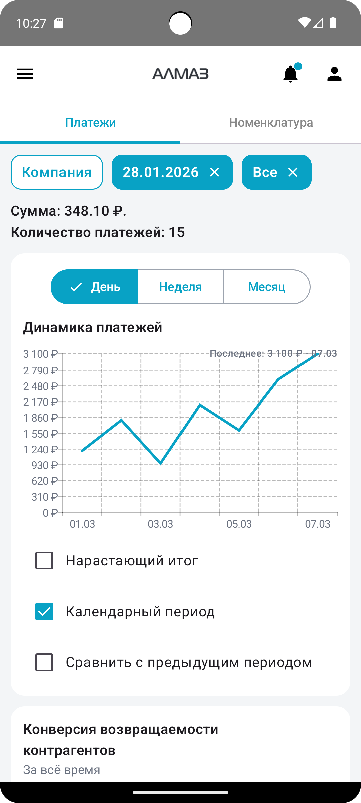
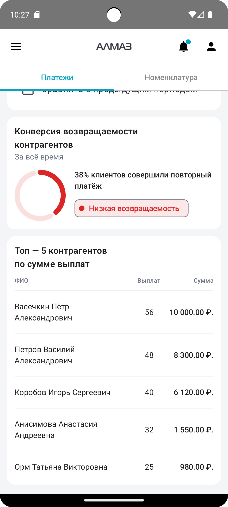
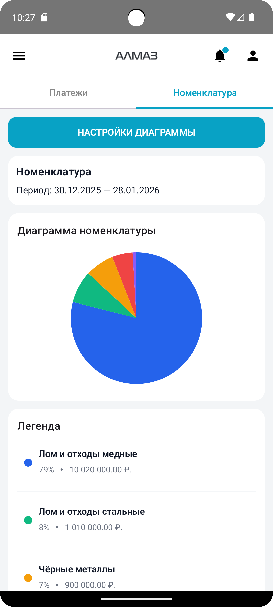
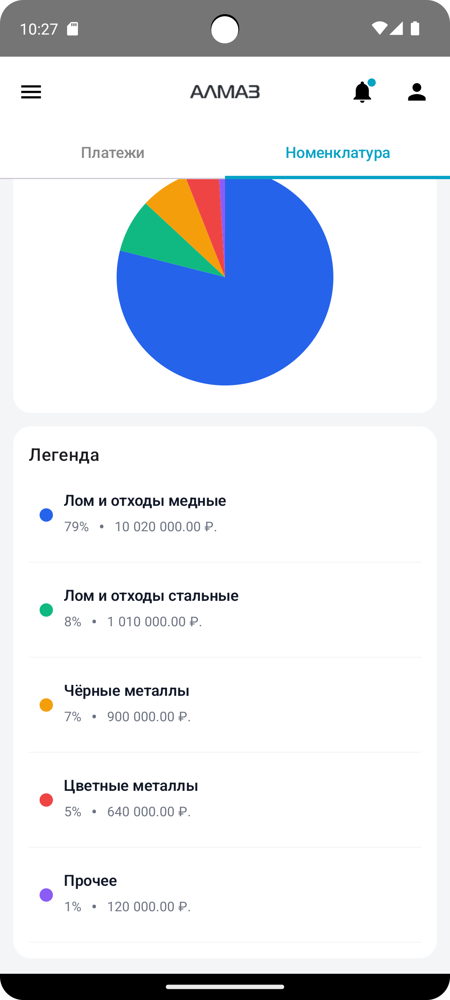

Экран **«Аналитика»** отображает сводные данные по работе в приложении **«Алмаз-Онлайн Mobile»**.

В верхней части экрана можно переключаться между двумя разделами:

- **Платежи**;
- **Номенклатура**.

В нижней части экрана доступны фильтры, которые позволяют уточнить отображаемые данные.

---

## Переключение вкладок

В верхней части экрана расположены две вкладки:

| Вкладка | Описание |
|---|---|
| **Платежи** | Отображает аналитику по платежам |
| **Номенклатура** | Отображает аналитику по позициям номенклатуры |

Чтобы переключиться между разделами, нажмите нужную вкладку.

---

# Вкладка «Платежи»

## Фильтры

В верхней части вкладки **«Платежи»** отображается строка фильтров.

Фильтры используются для быстрой настройки отображаемых данных.

С их помощью можно уточнить период, параметры платежей или другие доступные условия отбора.

---

## Итоги

Ниже фильтров отображаются итоговые значения по выбранным данным:

- общая сумма;
- количество платежей.

Эти показатели позволяют быстро оценить объём операций за выбранный период.

---

## График платежей

Далее отображается карточка с графиком платежей.

На графике видно динамику платежей по дням или выбранному периоду.

| Планшет | Телефон |
|---|---|
| { height="360" } | { height="360" } |

---

## Конверсия возврата

Ниже графика отображается карточка **«Конверсия»**.

В карточке показывается процент конверсии возврата.

---

## Топ-5 контрагентов

В нижней части вкладки отображается список **топ-5 контрагентов**.

В списке указываются:

- имя или название контрагента;
- количество операций;
- сумма.

| Планшет | Телефон |
|---|---|
| { height="360" } | { height="360" } |

---

# Вкладка «Номенклатура»

## Назначение

Во вкладке **«Номенклатура»** отображается распределение по видам номенклатуры за выбранный период.

Этот раздел помогает оценить структуру принятых позиций и их доли в общем объёме.

---

## Кнопка «Настройки»

В верхней части вкладки находится кнопка **«Настройки»**.

Она открывает настройки диаграммы.

---

## Период аналитики

Ниже отображается выбранный период аналитики по номенклатуре:

**с… по…**

Период определяет, за какие даты будут рассчитаны и показаны данные.

---

## Круговая диаграмма

Далее отображается круговая диаграмма.

На диаграмме видно распределение по категориям номенклатуры.

Можно выбрать сектор диаграммы. После выбора сектор станет выделенным.

| Планшет | Телефон |
|---|---|
| { height="360" } | { height="360" } |

---

## Легенда

Ниже диаграммы отображается список категорий — легенда.

По элементам легенды можно нажимать.

При выборе категории в легенде она будет выделена так же, как при выборе сектора на диаграмме.

| Планшет | Телефон |
|---|---|
| { height="360" } | { height="360" } |

---

!!! tip "Рекомендация"
    Перед анализом данных проверьте выбранный период и фильтры. Это поможет получить корректную сводку.