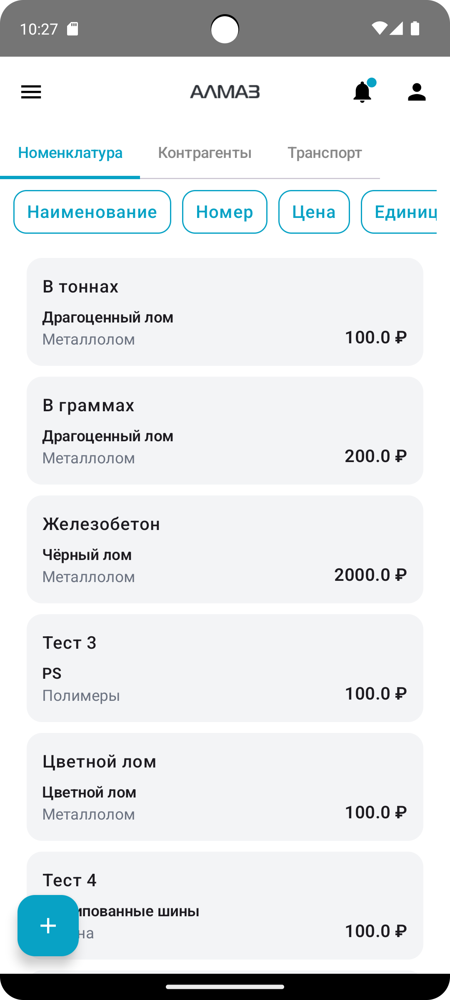

Экран **«Справочники»** предназначен для работы с основными списками данных, которые используются при оформлении документов и выплат.

В разделе доступны справочники:

- **Лом**;
- **Контрагенты**;
- **Транспорт**.

На экране можно:

- просматривать список записей;
- искать и фильтровать данные;
- добавлять новые записи;
- редактировать записи;
- удалять записи, если у пользователя есть соответствующие права.

---

## Переключение разделов

В верхней части экрана расположены вкладки справочников:

- **Лом**;
- **Контрагенты**;
- **Транспорт**.

Чтобы перейти к нужному справочнику, нажмите соответствующую вкладку.

После переключения на экране отобразится список выбранного справочника.

---

## Отображение справочников

| Планшет | Телефон |
|---|---|
| { height="360" } | { height="360" } |

---

## Фильтры

Если для справочника доступны фильтры, их можно открыть и настроить.

После применения фильтров список обновится автоматически.

Фильтры помогают быстрее найти нужную запись в большом списке.

---

## Обновление списка

Чтобы обновить данные справочника, потяните список вниз.

После этого приложение выполнит обновление и загрузит актуальные данные.

---

## Открытие записи

Чтобы открыть запись справочника, нажмите на нужную строку или карточку в списке.

Дальнейшее поведение зависит от типа устройства.

---

## Отображение на телефоне

На телефоне используется режим одного экрана.

После нажатия на запись открывается меню действий снизу.

В меню могут быть доступны действия:

- **Редактировать**;
- **Удалить**.

Набор действий зависит от прав пользователя.

---

## Отображение на планшете

На планшете или широком экране используется двухпанельный режим.

В этом режиме:

- слева отображается список записей;
- справа отображается карточка или форма редактирования выбранной записи.

| Планшет |
|---|
| { height="420" } |

---

## Добавление новой записи

В нижней части экрана расположена кнопка **«+»**.

Чтобы добавить новую запись:

1. Нажмите кнопку **«+»**.
2. Откроется форма создания записи.
3. Заполните необходимые данные.
4. Нажмите **«Сохранить»**.

После сохранения новая запись появится в списке справочника.

---

## Редактирование записи

Чтобы изменить запись:

1. Выберите запись из списка.
2. На телефоне нажмите **«Редактировать»** в меню действий.
3. На планшете измените поля в правой части экрана.
4. Нажмите **«Сохранить»**.

После сохранения изменения будут применены к выбранной записи.

---

## Удаление записи

Если удаление доступно пользователю:

1. Выберите запись из списка.
2. Нажмите **«Удалить»**.
3. Подтвердите удаление в окне подтверждения.

!!! warning "Важно"
    Удаление записи может быть недоступно, если у пользователя нет нужных прав или запись уже используется в документах.

---

## Возможные проблемы

| Проблема | Возможная причина | Что сделать |
|---|---|---|
| Не отображается нужная запись | Применены фильтры или список не обновлён | Сбросить фильтры и обновить список |
| Нет кнопки добавления | У пользователя нет прав на создание записей | Проверить права пользователя |
| Нет действия **«Редактировать»** | Недостаточно прав | Обратиться к администратору |
| Нет действия **«Удалить»** | Недостаточно прав или запись используется в документах | Проверить права и связанные документы |
| Изменения не сохраняются | Не заполнены обязательные поля | Проверить форму и заполнить обязательные данные |

!!! tip "Рекомендация"
    Перед созданием выплаты проверьте актуальность справочников. Это поможет быстрее выбрать контрагента, транспорт и позиции лома при оформлении документов.