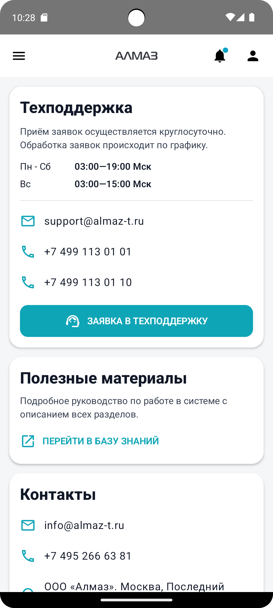
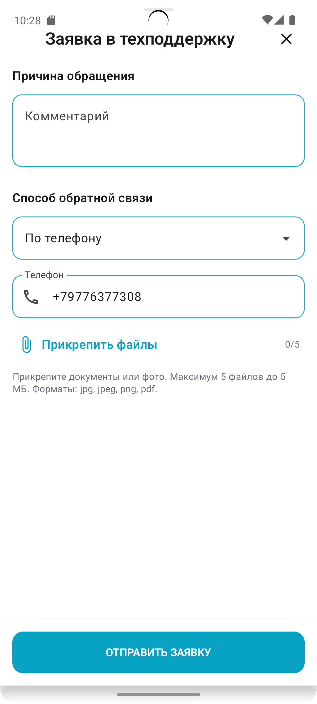

Экран **«Помощь»** предназначен для быстрого обращения в службу поддержки и просмотра справочной информации.

На этом экране можно:

- связаться с поддержкой по email или телефону;
- создать обращение в поддержку;
- открыть базу знаний с инструкциями;
- посмотреть контакты компании;
- открыть адрес компании на карте.

---

## Отображение экрана

| Планшет | Телефон |
|---|---|
| { height="360" } | { height="360" } |

---

## Поддержка

В карточке **«Поддержка»** отображается информация для связи со службой поддержки.

В карточке указаны:

- краткое описание, как получить помощь;
- график работы поддержки;
- email поддержки;
- телефоны поддержки;
- кнопка **«Создать обращение»**.

---

## Как связаться с поддержкой

Для связи с поддержкой можно использовать email или телефон.

Доступные действия:

| Действие | Результат |
|---|---|
| Нажать на email | Откроется почтовое приложение |
| Нажать на телефон | Откроется набор номера |
| Нажать и удерживать email или телефон | Значение скопируется в буфер обмена |

После копирования появится сообщение:

**«Скопировано»**

---

## Создание обращения в поддержку

Чтобы создать обращение, нажмите кнопку:

**«Создать обращение»**

После нажатия откроется форма обращения в поддержку.

---

## База знаний

На экране **«Помощь»** есть карточка **«База знаний»**.

Через неё можно открыть руководство и инструкции по работе с системой.

Ссылка открывается во внешнем браузере.

!!! info "Примечание"
    Для открытия базы знаний требуется подключение к интернету.

---

## Контакты компании

В карточке **«Контакты»** отображаются контактные данные компании:

- email компании;
- телефон;
- адрес.

Доступные действия:

| Действие | Результат |
|---|---|
| Нажать на email | Откроется почтовое приложение |
| Нажать на телефон | Откроется набор номера |
| Нажать на адрес | Откроется карта |
| Нажать и удерживать строку | Данные скопируются в буфер обмена |

---

# Создание обращения

## Описание проблемы

В поле **«Текст обращения»** необходимо описать проблему.

Рекомендуется указать:

- что вы делали;
- какой результат ожидали;
- что произошло фактически;
- номер документа, если проблема связана с документом;
- дату операции;
- сумму операции, если она относится к проблеме.

Если поле не заполнить, приложение покажет подсказку об ошибке.

!!! tip "Рекомендация"
    Чем подробнее описана проблема, тем быстрее служба поддержки сможет разобраться в ситуации.

---

## Выбор способа связи

Далее необходимо выбрать способ связи.

Доступные варианты:

- **Телефон**;
- **Email**.

Выбор выполняется через выпадающий список.

Ниже отображаются ваши контактные данные. Они доступны только для просмотра.

---

## Прикрепление файлов

При необходимости к обращению можно приложить файлы.

Можно прикрепить до **5 файлов**.

Поддерживаются:

- изображения, например скриншоты;
- PDF-файлы.

Чтобы добавить файлы:

1. Нажмите строку **«Прикрепить файлы»**.
2. Выберите нужные файлы.
3. Проверьте, что файлы добавились в список.

Рядом отображается счётчик добавленных файлов:

- **0/5**;
- **1/5**;
- **2/5**;
- и так далее.

---

## Список добавленных файлов

После прикрепления файлы отображаются списком.

Для каждого файла показываются:

- название;
- размер;
- тип файла;
- иконка PDF или изображения;
- кнопка удаления в виде корзины.

Чтобы удалить файл из обращения, нажмите на иконку корзины рядом с нужным файлом.

---

## Ограничение по размеру файла

Максимальный размер одного файла — **5 МБ**.

Если файл больше 5 МБ:

- он будет подсвечен красным;
- появится предупреждение;
- файл необходимо заменить на меньший.

!!! warning "Важно"
    Если нужно приложить большой скриншот или документ, уменьшите размер файла перед отправкой.

---

## Отправка обращения

В нижней части формы расположена кнопка:

**«Отправить»**

Чтобы отправить обращение:

1. Заполните текст обращения.
2. Выберите способ связи.
3. При необходимости прикрепите файлы.
4. Нажмите **«Отправить»**.

Во время отправки на кнопке появится индикатор загрузки.

После успешной отправки форма обращения закроется.

---

## Отображение формы обращения

| Планшет | Телефон |
|---|---|
| { height="360" } | { height="360" } |

---

## Возможные проблемы

| Проблема | Возможная причина | Что сделать |
|---|---|---|
| Не отправляется обращение | Не заполнен текст обращения | Заполните описание проблемы |
| Нельзя прикрепить файл | Файл больше 5 МБ или неподдерживаемый формат | Выберите файл меньшего размера в формате изображения или PDF |
| Не открывается почта | На устройстве нет настроенного почтового приложения | Скопируйте email долгим нажатием и используйте другое приложение |
| Не открывается карта | На устройстве нет приложения карт или нет интернета | Скопируйте адрес и откройте его вручную |
| Не открывается база знаний | Нет подключения к интернету | Проверьте соединение и повторите попытку |

!!! tip "Совет"
    При обращении в поддержку прикладывайте скриншоты ошибки и указывайте номер документа. Это ускорит обработку обращения.