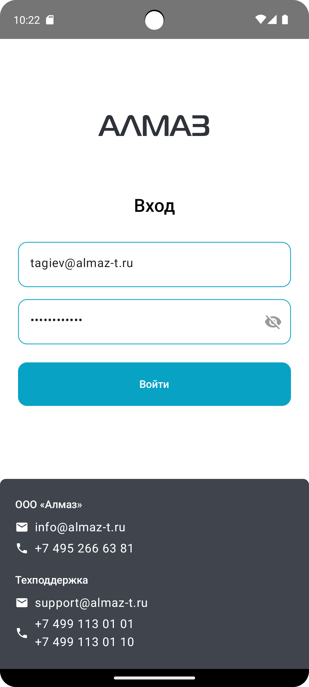
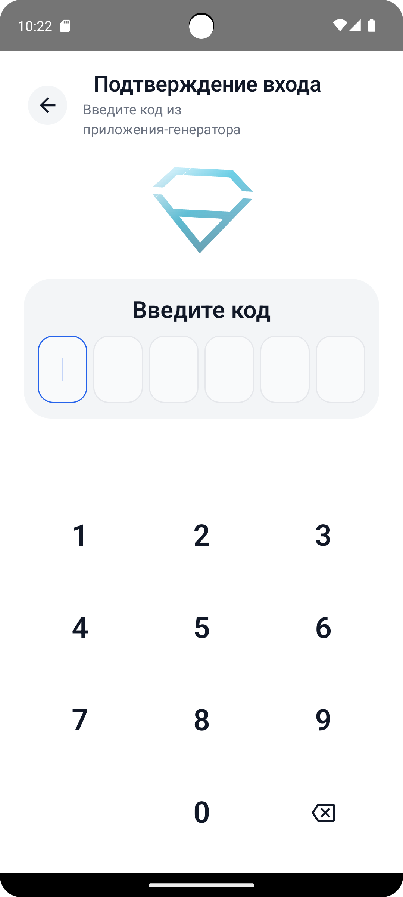

После запуска приложения **«Алмаз-Онлайн Mobile»** откроется экран входа.

На экране отображаются:

- логотип компании;
- поле для ввода email;
- поле для ввода пароля;
- кнопка **«Войти»**;
- контакты компании и службы поддержки в нижней части экрана.

---

## Ввод email и пароля

В поле **Email** введите адрес электронной почты.

В поле **Пароль** введите ваш пароль.

Пароль скрыт точками. При необходимости можно нажать на значок **глазка**, чтобы увидеть введённый пароль.

---

## Отображение на устройствах

Экран входа адаптирован для разных типов устройств:

- планшет;
- телефон.

| Планшет | Телефон |
|---|---|
| { height="360" } | { height="360" } |

---

## Вход в приложение

После ввода email и пароля нажмите кнопку **«Войти»**.

### Если данные введены правильно

Если email и пароль введены правильно, приложение автоматически перейдёт к подтверждению входа.

### Если возникла ошибка

Если email или пароль введены неверно, под кнопкой **«Войти»** появится сообщение с ошибкой.

В этом случае проверьте введённые данные и повторите попытку.

---

# Подтверждение входа

В системе **«Алмаз-Онлайн»** подключена двухфакторная защита учётной записи.

После успешного ввода email и пароля необходимо ввести код аутентификации.

Код подтверждения может быть получен:

- по SMS;
- из приложения-аутентификатора, если для пользователя настроен OTP.

---

## Ввод кода аутентификации

Введите 6-значный код аутентификации в поле подтверждения.

Для ввода кода можно использовать:

- экранную клавиатуру;
- вставку кода из буфера обмена.

После успешного ввода кода приложение автоматически перейдёт в **Реестр ПСА**.

| 2FA | 2FA |
|---|---|
| { height="360" } | { height="360" } |

---

## Частые вопросы

### Код не приходит по SMS. Что делать?

Подождите немного и попробуйте запросить код повторно.

Если код всё равно не приходит, обратитесь в службу поддержки.

---

### Я ввёл код, но приложение показывает ошибку. Что делать?

Проверьте, что введено ровно **6 цифр**.

Если ошибка повторяется, запросите новый код или обратитесь в службу поддержки.

---

### Можно вставить код, если он скопирован?

Да.

Для вставки кода нажмите и удерживайте поле ввода кода, затем выберите действие вставки из буфера обмена.

---

!!! warning "Важно"
    Не передавайте пароль и коды подтверждения третьим лицам. Эти данные используются для доступа к вашей учётной записи.