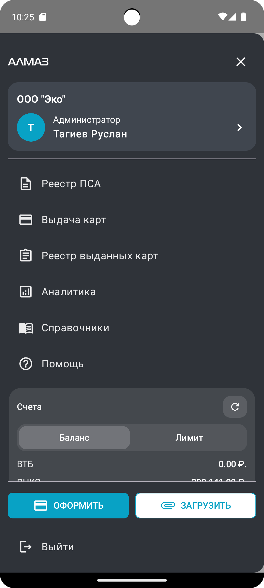

Боковое меню приложения **«Алмаз-Онлайн Mobile»** предназначено для быстрого доступа к основным разделам системы и информации о пользователе.

Меню можно открыть:

- нажатием на кнопку меню;
- свайпом от края экрана.

---

## Отображение на устройствах

Боковое меню адаптировано для разных типов устройств:

- планшет;
- телефон.

| Планшет | Телефон |
|---|---|
| { height="360" } | { height="360" } |

---

## Карточка профиля

В верхней части бокового меню отображается карточка профиля пользователя.

В карточке профиля отображаются:

- название организации;
- роль пользователя;
- имя пользователя;
- аватар пользователя, если он добавлен.

Если аватар не установлен, отображается круг с первой буквой или инициалом пользователя.

При нажатии на карточку профиля открывается экран **«Профиль»**.

---

## Основные пункты меню

Ниже карточки профиля расположен список доступных разделов системы.

В списке могут отображаться:

- реестры;
- справочники;
- выплаты;
- документы;
- другие функции, доступные пользователю.

Набор пунктов меню зависит от роли пользователя и доступных ему прав.

---

## Финансовая информация

В боковом меню отображается отдельный финансовый блок.

Он предназначен для быстрого просмотра краткой финансовой информации без перехода в отдельные экраны.

В блоке может отображаться актуальная информация по доступным суммам, балансу или лимитам.

Также доступна возможность обновления данных.

!!! tip "Рекомендация"
    Используйте обновление финансового блока, если необходимо быстро проверить актуальность данных перед оформлением выплаты.

---

## Быстрые действия

В нижней части меню расположены две быстрые кнопки:

| Кнопка | Назначение |
|---|---|
| **ОФОРМИТЬ** | Быстро начать оформление выплаты |
| **ЗАГРУЗИТЬ** | Быстро загрузить документ или файл |

Кнопка **«ОФОРМИТЬ»** отображается с иконкой карты и позволяет быстро перейти к созданию выплаты.

Кнопка **«ЗАГРУЗИТЬ»** позволяет быстро перейти к загрузке документа или файла.

Эти действия вынесены отдельно, чтобы пользователь мог начать основную операцию без поиска нужного раздела в меню.

---

## Выход из приложения

В нижней части меню расположен отдельный пункт:

**«Выйти»**

Он используется для выхода из текущей учётной записи.

После выхода для продолжения работы потребуется повторная авторизация.

!!! warning "Важно"
    Если устройство используется несколькими пользователями, после завершения работы рекомендуется выполнить выход из учётной записи.
