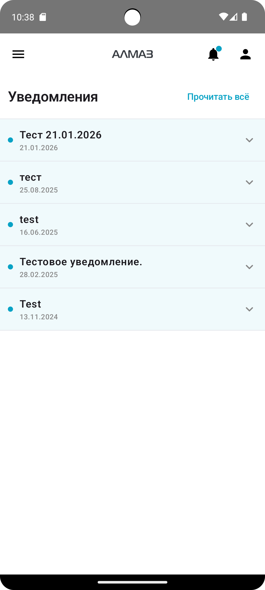

Экран **«Уведомления»** показывает список сообщений от системы.

В уведомлениях могут отображаться:

- важные события;
- системные сообщения;
- информация об обновлениях;
- другие сообщения, требующие внимания пользователя.

---

## Что отображается на экране

В верхней части экрана отображаются:

- заголовок **«Уведомления»**;
- кнопка **«Отметить все как прочитанные»**.

Ниже расположен список уведомлений.

---

## Отображение на устройствах

| Планшет | Телефон |
|---|---|
| { height="360" } | { height="360" } |

---

## Непрочитанные уведомления

Непрочитанные уведомления выделяются визуально.

Обычно они имеют:

- маленькую цветную точку слева;
- лёгкую подсветку фона.

Прочитанные уведомления отображаются без цветной точки и без подсветки.

---

## Открытие уведомления

Чтобы прочитать уведомление:

1. Нажмите на уведомление в списке.
2. Уведомление развернётся.
3. Внутри будет показан полный текст сообщения.

Чтобы свернуть уведомление, нажмите на него ещё раз.

---

## Стрелка справа

Справа у уведомления отображается стрелка.

| Состояние | Что означает |
|---|---|
| Стрелка вниз | Уведомление можно развернуть |
| Стрелка вверх | Уведомление открыто, его можно свернуть |

---

## Отметить все уведомления прочитанными

Если нужно быстро убрать отметки непрочитанных уведомлений, нажмите кнопку:

**«Отметить все как прочитанные»**

После нажатия:

- исчезнут точки непрочитанных уведомлений;
- пропадёт подсветка;
- уведомления будут считаться прочитанными.

!!! warning "Рекомендация"
    Перед тем как отметить все уведомления прочитанными, рекомендуется ознакомиться с их содержанием. Некоторые сообщения могут содержать важную информацию.

---

!!! tip "Совет"
    Регулярно проверяйте раздел **«Уведомления»**, чтобы не пропустить важные сообщения системы.