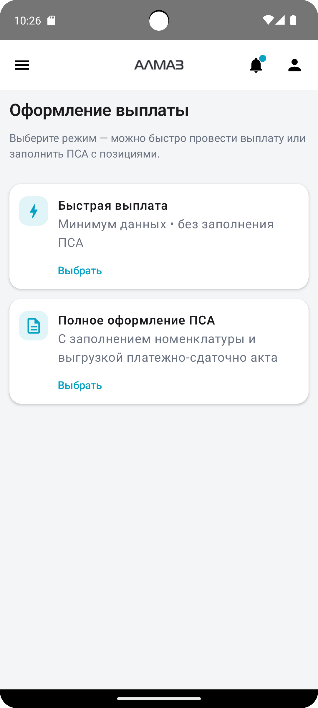
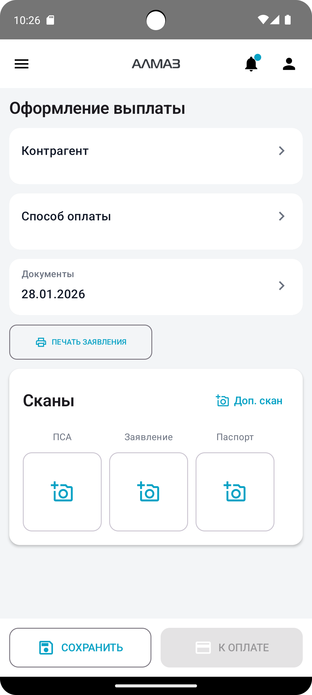
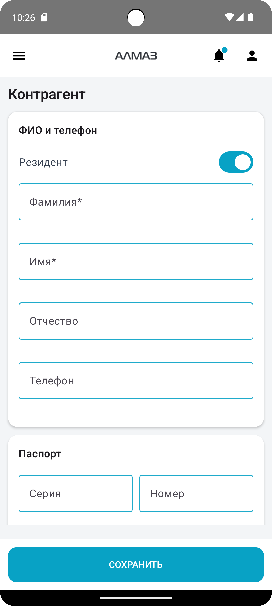
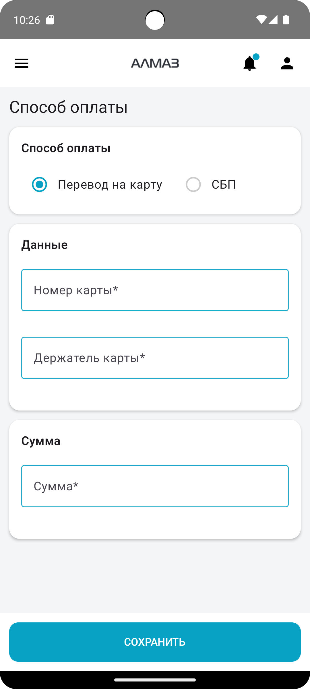
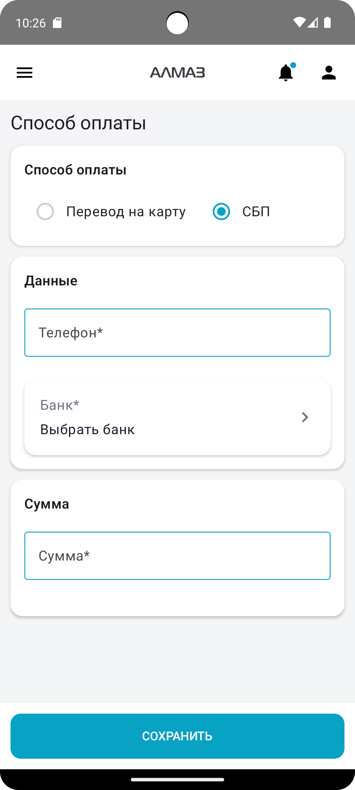
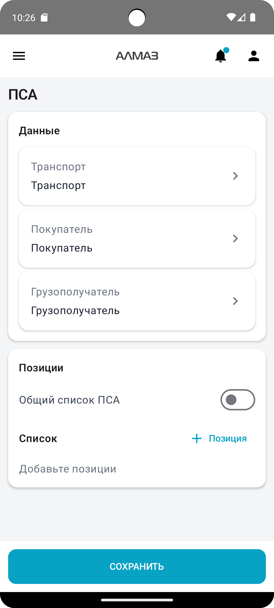
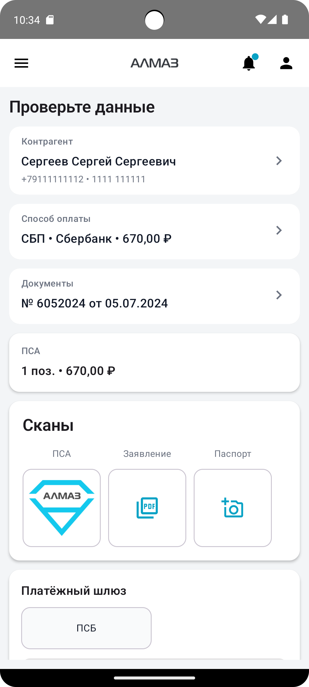
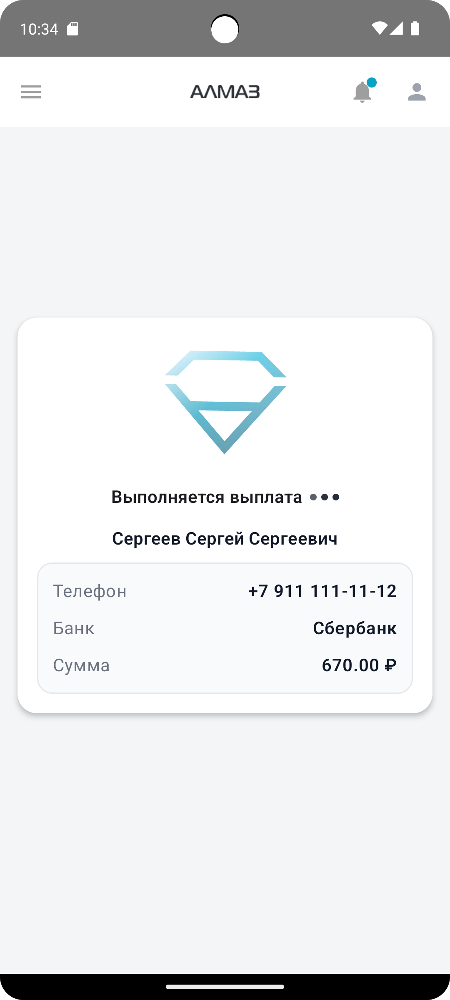

При создании выплаты сначала необходимо выбрать режим оформления.

Доступны два режима:

| Режим | Описание |
|---|---|
| **Быстрый режим** | Используется для быстрого оформления выплаты без заполнения ПСА внутри формы |
| **Полный режим** | Используется для полного оформления выплаты, включая заполнение ПСА |

Чтобы продолжить, нажмите кнопку **«Выбрать»** на нужной карточке.

---

## Отображение выбора режима

| Планшет | Телефон |
|---|---|
| { height="360" } | { height="360" } |

---

# Создание выплаты — основная форма

На основной форме данные заполняются по шагам через отдельные карточки.

Основные карточки:

- **Контрагент**;
- **Способ оплаты**;
- **ПСА** — только в полном режиме;
- **Сканы**;
- **Документы**.

| Планшет | Телефон |
|---|---|
| { height="360" } | { height="360" } |

---

## Контрагент

Карточка **«Контрагент»** используется для заполнения данных получателя выплаты.

Чтобы заполнить данные:

1. Нажмите карточку **«Контрагент»**.
2. Заполните информацию о контрагенте.
3. Сохраните данные и вернитесь к основной форме.

Если контрагент не заполнен, при попытке сохранить документ или перейти к оплате приложение покажет ошибку.

---

## Отображение карточки «Контрагент»

| Планшет | Телефон |
|---|---|
| { height="360" } | { height="360" } |

---

## Минимальные данные и печать заявления

После заполнения минимальных обязательных данных можно перейти к оплате.

Кнопка **«Печать заявления»** формирует PDF-файл и позволяет сохранить его в выбранную директорию.

!!! info "Примечание"
    PDF-файл заявления можно сохранить на устройстве и использовать для дальнейшей печати или передачи ответственному сотруднику.

---

# Способ оплаты

Карточка **«Способ оплаты»** используется для выбора и заполнения данных оплаты.

Чтобы заполнить способ оплаты:

1. Нажмите карточку **«Способ оплаты»**.
2. Выберите нужный способ выплаты.
3. Заполните необходимые поля.
4. Сохраните данные и вернитесь к основной форме.

Обычно доступны следующие варианты:

| Способ оплаты | Необходимые данные |
|---|---|
| **Перевод на карту** | Номер карты, держатель карты, сумма |
| **СБП** | Номер телефона, банк получателя, сумма |

Если данные заполнены не полностью, приложение покажет ошибку.

---

## Отображение способа оплаты

| Планшет | Телефон |
|---|---|
| { height="360" } | { height="360" } |

| Планшет | Телефон |
|---|---|
| { height="360" } | { height="360" } |

---

# ПСА

Карточка **«ПСА»** отображается только в **полном режиме**.

Если выбран полный режим, нажмите карточку **«ПСА»** и заполните позиции приёмо-сдаточного акта.

Если в ПСА нет позиций, при сохранении или оплате приложение покажет ошибку.

---

## Заполнение ПСА

В карточке **«ПСА»** необходимо указать позиции принимаемого лома.

Обычно заполняются:

- номенклатура;
- количество;
- цена;
- сумма;
- дополнительные параметры, если они предусмотрены формой.

!!! warning "Важно"
    В полном режиме без заполненных позиций ПСА нельзя корректно сохранить документ или перейти к оплате.

---

## Отображение ПСА

| Планшет | Телефон |
|---|---|
| { height="360" } | { height="360" } |

---

# Выплата

## Назначение экрана

Экран **«Выплата»** используется для финальной проверки и проведения оплаты.

На этом экране необходимо проверить:

- контрагента;
- способ оплаты;
- документы;
- ПСА;
- сканы;
- сумму;
- выбранный платёжный шлюз.

После проверки пользователь выбирает способ проведения оплаты, то есть платёжный шлюз, и нажимает кнопку оплаты.

---

## Выбор платёжного шлюза

На экране выплаты отображаются доступные платёжные шлюзы.

Выберите шлюз, через который необходимо выполнить оплату.

Доступность шлюзов зависит от настроек организации, прав пользователя, подключённых счетов и лимитов.

!!! warning "Важно"
    Перед оплатой проверьте сумму, данные получателя и выбранный платёжный шлюз.

---

## Проведение оплаты

Чтобы выполнить оплату:

1. Проверьте все заполненные данные.
2. Выберите платёжный шлюз.
3. Нажмите кнопку оплаты.
4. Дождитесь результата операции.

После отправки платежа приложение отобразит результат или текущий статус операции.

---

## Отображение экрана выплаты

| Планшет | Телефон |
|---|---|
| { height="360" } | { height="360" } |

| Планшет | Телефон |
|---|---|
| { height="360" } | { height="360" } |

---

## Возможные ошибки

| Ошибка | Причина | Что сделать |
|---|---|---|
| Не заполнен контрагент | Карточка **«Контрагент»** не заполнена | Откройте карточку и заполните данные |
| Не заполнен способ оплаты | Не указан номер карты, держатель, телефон, банк или сумма | Заполните данные оплаты |
| Нет позиций ПСА | В полном режиме не заполнены позиции ПСА | Добавьте позиции в карточке **«ПСА»** |
| Нет доступного шлюза | У пользователя нет доступа к шлюзу или не настроен счёт | Обратитесь к администратору |
| Оплата не проходит | Ошибка данных, лимитов или банка | Проверьте данные и статус операции |

!!! tip "Рекомендация"
    Перед оплатой всегда проверяйте контрагента, сумму, способ оплаты и выбранный платёжный шлюз.