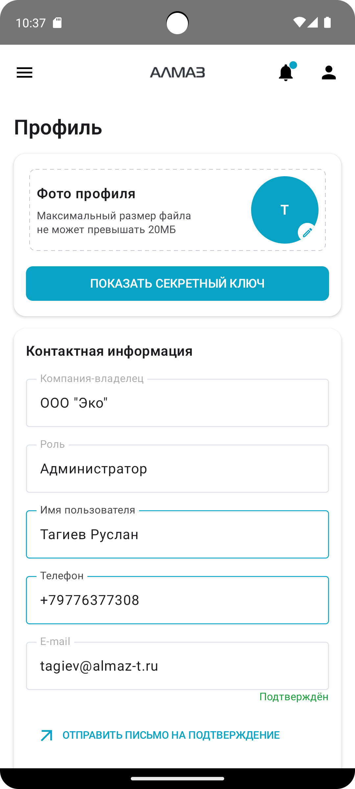

Экран **«Профиль»** отображает данные пользователя и позволяет управлять основной информацией учётной записи.

На экране профиля можно:

- изменить имя и телефон;
- добавить или заменить фото профиля;
- проверить статус подтверждения email;
- отправить письмо для подтверждения email;
- посмотреть историю входов;
- при необходимости показать секретный ключ для приложения-генератора кодов **OTP/2FA**.

---

## Отображение профиля

| Планшет | Телефон |
|---|---|
| { height="360" } | { height="360" } |

---

## Фото профиля

В верхнем блоке профиля можно добавить или заменить фото пользователя.

Фото отображается в круглом аватаре.

Если фото не установлено, вместо него может отображаться первая буква имени или инициалы пользователя.

---

## Как сменить фото

Чтобы добавить или заменить фото профиля:

1. Нажмите на круглый аватар.
2. Выберите изображение из галереи.
3. Дождитесь загрузки изображения.

Значок карандаша на аватаре показывает, что фото можно редактировать.

---

## Ограничения для изображения

Для фото профиля действуют следующие ограничения:

| Параметр | Требование |
|---|---|
| Формат файла | JPG или PNG |
| Размер файла | До 20 МБ |

!!! warning "Важно"
    Если изображение не загружается, проверьте формат и размер файла.

---

## Секретный ключ для приложения-генератора кодов

В профиле есть кнопка:

**«ПОКАЗАТЬ СЕКРЕТНЫЙ КЛЮЧ»**

Она используется, если пользователь применяет вход через приложение-генератор кодов **OTP/2FA**.

После нажатия откроется окно с секретным ключом.

Также будет показан **QR-код**, который можно использовать для быстрого добавления ключа в приложение-генератор кодов.

!!! info "Копирование секретного ключа"
    Чтобы скопировать секретный ключ, нажмите на строку с секретом. Значение будет скопировано в буфер обмена.

!!! warning "Важно"
    Не передавайте секретный ключ третьим лицам. Он используется для генерации одноразовых кодов доступа.

---

## Контактные данные

В блоке **«Контактная информация»** отображаются данные пользователя:

- компания владелец;
- роль;
- имя;
- телефон;
- email;
- статус подтверждения email.

---

## Изменение имени и телефона

Чтобы изменить имя или телефон:

1. Введите новые данные в поля **Имя** и **Телефон**.
2. Нажмите кнопку **«Сохранить»**.
3. Дождитесь завершения сохранения.

Во время сохранения может отображаться индикатор загрузки.

!!! tip "Рекомендация"
    После изменения телефона проверьте, что номер указан корректно. Он может использоваться для подтверждения операций и входа.

---

## Подтверждение email

В профиле отображается статус подтверждения email.

Возможные статусы:

| Статус | Описание |
|---|---|
| **Подтверждён** | Email подтверждён. Обычно отображается зелёным цветом |
| **Не подтверждён** | Email не подтверждён. Обычно отображается красным цветом |

Если email не подтверждён, можно отправить письмо для подтверждения.

Для этого нажмите кнопку отправки письма подтверждения.

---

## История входов

В нижней части профиля отображается список последних входов в учётную запись.

В истории входов отображаются:

- дата и время входа;
- IP-адрес;
- информация об устройстве или браузере.

| Планшет |
|---|
| { height="360" } |

---

## Возможные проблемы

| Проблема | Возможная причина | Что сделать |
|---|---|---|
| Фото не загружается | Неверный формат или размер больше 20 МБ | Используйте файл JPG или PNG размером до 20 МБ |
| Не сохраняется имя или телефон | Не заполнены обязательные поля или ошибка соединения | Проверьте данные и подключение к интернету |
| Email не подтверждён | Пользователь не перешёл по ссылке из письма | Отправьте письмо подтверждения повторно |
| Не приходит письмо подтверждения | Ошибка доставки или письмо попало в спам | Проверьте папку «Спам» или обратитесь в поддержку |

!!! warning "Важно"
    Не передавайте пароль, секретный ключ и одноразовые коды третьим лицам. Эти данные используются для доступа к вашей учётной записи.