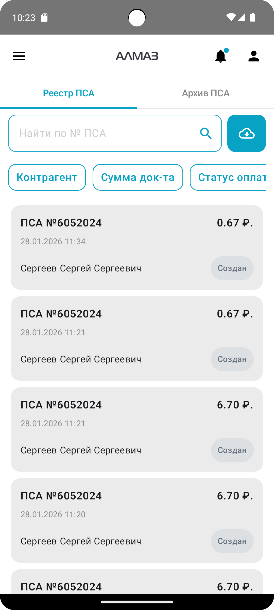
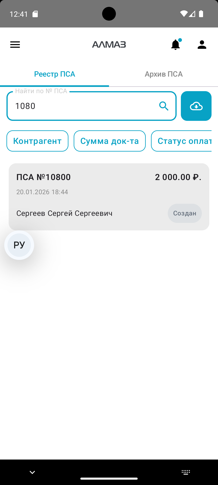
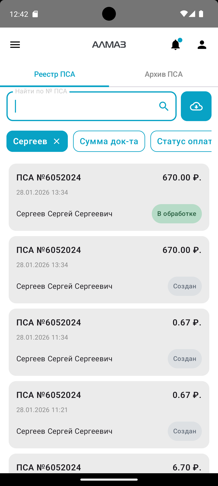
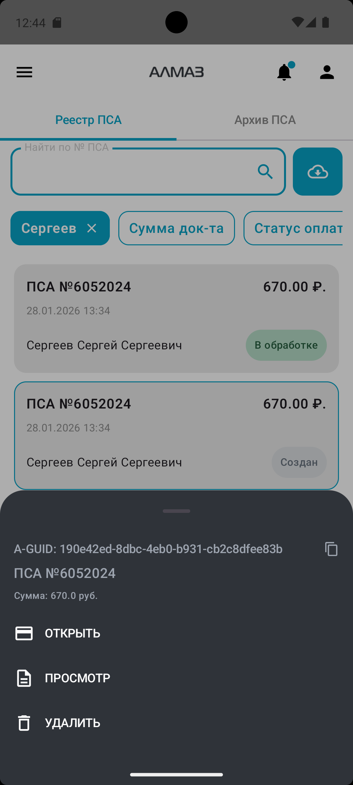
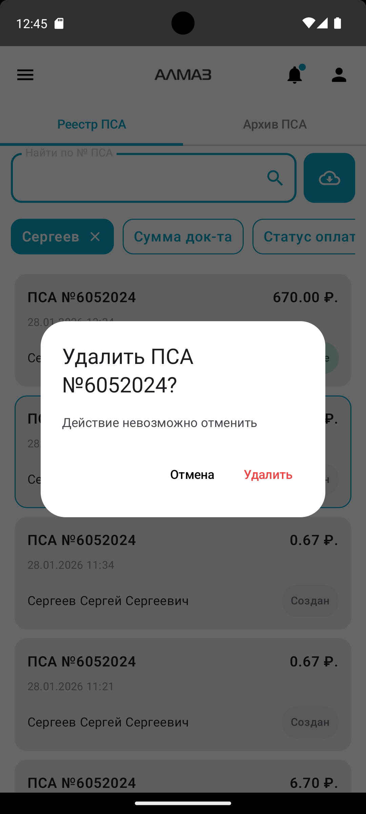
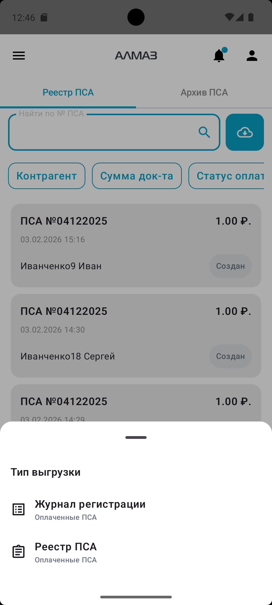

Раздел **«Реестр ПСА»** предназначен для работы с платёжно-сдаточными актами, далее **ПСА**.

На этом экране пользователь может:

- просматривать список ПСА;
- искать документы;
- фильтровать документы;
- открывать и просматривать ПСА;
- выгружать реестр или журнал;
- выполнять доступные действия с документом.

Набор доступных действий зависит от статуса документа и прав пользователя.

---

## Реестр и Архив

В верхней части экрана расположены две вкладки:

| Вкладка | Описание |
|---|---|
| **Реестр** | Актуальные документы, находящиеся в работе |
| **Архив** | Документы, созданные более 6 месяцев назад |

Чтобы переключиться между разделами, нажмите нужную вкладку.

| Телефон |
|---|
| { width="260"} |

---

## Поиск документа

Под вкладками находится строка поиска:

**«Найти ПСА»**

Для поиска документа введите номер, часть номера.

После ввода значения список документов обновится автоматически.

!!! tip "Рекомендация"
    Если нужно быстро найти конкретный документ, начните вводить номер ПСА или часть номера.

| Телефон |
| --- |
| { width="260"} |

---

## Фильтры

Они отображаются ниже строки поиска в виде плашек или чипов.

Для применения фильтра:

1. Выберите нужный фильтр.
2. Измените его значение.
3. Дождитесь обновления списка.

После изменения фильтра список документов обновляется автоматически.

| Телефон |
| --- |
| { width="260"} |

---

## Обновление списка

Чтобы обновить список документов, потяните список вниз.

Такой способ обновления используется для получения актуальных данных без выхода с экрана.

---

## Список документов

Каждый документ в списке отображается отдельной карточкой.

В карточке документа обычно отображаются:

- номер ПСА;
- дата;
- ФИО/контрагент;
- сумма;
- статус.

Чтобы открыть доступные действия с документом, нажмите на карточку.

---

## Действия с документом

На телефоне при нажатии на карточку документа открывается меню действий снизу.

В верхней части меню отображаются основные данные документа:

- **A-GUID** документа;
- номер ПСА;
- сумма.

!!! info "Копирование A-GUID"
    Чтобы скопировать **A-GUID** документа, нажмите на строку с A-GUID. Значение будет скопировано в буфер обмена.

| Телефон |
| --- |
| { width="260"} |

---

## Доступные действия

Набор кнопок в меню зависит от статуса документа и прав пользователя.

Чаще всего доступны следующие действия:

| Действие | Описание |
|---|---|
| **Открыть** | Перейти к работе с ПСА |
| **Просмотр** | Открыть документ только для просмотра, без редактирования |
| **Обновить статус** | Обновить состояние документа |
| **Дублировать** | Создать повторную заявку на основании документа |
| **Удалить** | Удалить документ |

!!! warning "Важно"
    Некоторые действия могут быть недоступны, если у пользователя нет необходимых прав или документ находится в статусе, при котором действие запрещено.

---

## Удаление документа

Если пользователь нажал кнопку **«Удалить»**, приложение откроет окно подтверждения.

Чтобы удалить документ, необходимо подтвердить действие.

Если удаление не требуется, закройте окно подтверждения или отмените действие.

| Телефон |
| --- |
| { width="260"} |

---

## Пустой архив

Если во вкладке **«Архив»** нет документов, приложение покажет сообщение о том, что архив пуст.

---

## Выгрузка списка

Рядом со строкой поиска расположена кнопка выгрузки с иконкой скачивания.

Она позволяет скачать документы за выбранный период.

Обычно сценарий выгрузки выглядит так:

1. Нажмите кнопку выгрузки.
2. Выберите тип выгрузки.
3. Укажите период **с…по…**.
4. Скачайте файл.

| Телефон |
| --- |
| { width="260"} |

---

## Отображение на широком экране

На широких экранах, например на планшете, интерфейс может отображаться в двухпанельном режиме.

В этом случае:

- слева отображается список документов;
- справа отображаются подробности выбранного документа и доступные действия.

Чтобы посмотреть документ, выберите его в списке слева. Подробная информация откроется справа.

---

## Отображение на планшете

| Планшет | Планшет |
|---| --- |
| { height="420" } | { height="420" } |
