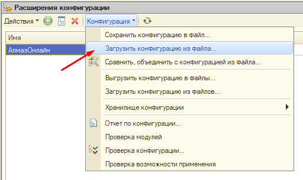
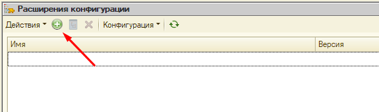
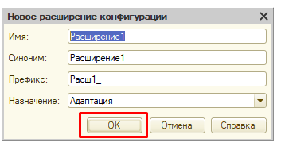
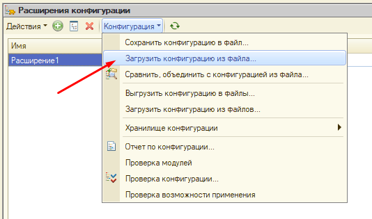
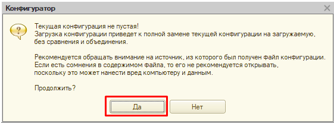
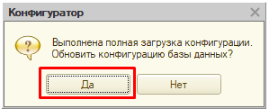
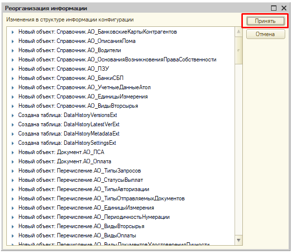
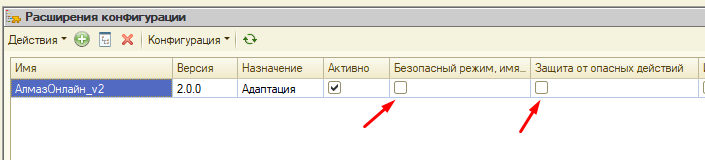

Данный раздел описывает установку модуля **«Алмаз-Онлайн»** в режиме **Конфигуратор**.

Модуль Алмаз устанавливается как расширение конфигурации 1С из файла `*.cfe`.

---

## Перед началом установки

Перед установкой рекомендуется:

1. Попросить пользователей завершить работу в текущей базе 1С.
2. Убедиться, что выполнено резервное копирование информационной базы.
3. Подготовить файл модуля Алмаз.
4. Проверить наличие прав для работы в режиме **Конфигуратор**.

!!! warning "Важно"
    Установку модуля в режиме **Конфигуратор** рекомендуется выполнять специалисту, который имеет опыт администрирования 1С.

---

## Открытие списка расширений

Для установки модуля выполните следующие действия:

1. Откройте 1С в режиме **Конфигуратор**.

2. В верхнем меню выберите:

    **Конфигурация → Расширения конфигурации**

После этого откроется окно **«Расширения конфигурации»**.

---

## Если расширение уже установлено

Если пункт **«АлмазОнлайн»** уже присутствует в списке расширений, необходимо загрузить новую версию расширения из файла.

Для этого:

1. Выберите расширение **«АлмазОнлайн»** в списке.

2. В окне **«Расширения конфигурации»** откройте меню:

    **Конфигурация → Загрузить конфигурацию из файла**

3. Выберите файл модуля Алмаз.

---

## Если расширение устанавливается впервые

Если расширение **«АлмазОнлайн»** ранее не устанавливалось, необходимо создать новое расширение.

Для этого:

1. В окне **«Расширения конфигурации»** нажмите кнопку добавления нового расширения.

2. В открывшемся окне **«Новое расширение конфигурации»** нажмите кнопку **«ОК»**.

После этого в списке расширений появится новое расширение.

---

## Загрузка файла модуля

После создания или выбора расширения выполните загрузку файла модуля.

1. Откройте меню:

    **Конфигурация → Загрузить конфигурацию из файла**

2. Выберите файл модуля Алмаз.

3. В открывшемся окне с предупреждением о замене текущей конфигурации на загружаемую нажмите кнопку **«Да»**.

!!! info "Примечание"
    Предупреждение о замене конфигурации относится к выбранному расширению, в которое загружается файл модуля.

---

## Обновление конфигурации базы данных

После загрузки файла система задаст вопрос об обновлении конфигурации базы данных.

На вопрос об обновлении конфигурации базы данных ответьте утвердительно.

---

## Реорганизация информации

После подтверждения обновления откроется окно **«Реорганизация информации»**.

Для сохранения изменений нажмите кнопку **«Принять»**.

Дождитесь окончания процесса записи данных.

---

## Отключение ограничивающих флагов

После окончания процесса записи данных необходимо снять флаги:

- **Безопасный режим**;
- **Защита от опасных действий**.

!!! warning "Важно"
    Если оставить включёнными флаги **«Безопасный режим»** или **«Защита от опасных действий»**, работа модуля может быть ограничена.

---

## Проверка установки

На этом установка модуля 1С завершена.

Для проверки результата:

1. Откройте базу 1С в пользовательском режиме.
2. Проверьте список разделов.
3. Убедитесь, что появился раздел **«Алмаз-Онлайн»**.

Если раздел **«Алмаз-Онлайн»** появился, модуль установлен корректно.

---

!!! tip "Рекомендация"
    Перед установкой через **Конфигуратор** рекомендуется сделать резервную копию информационной базы 1С.