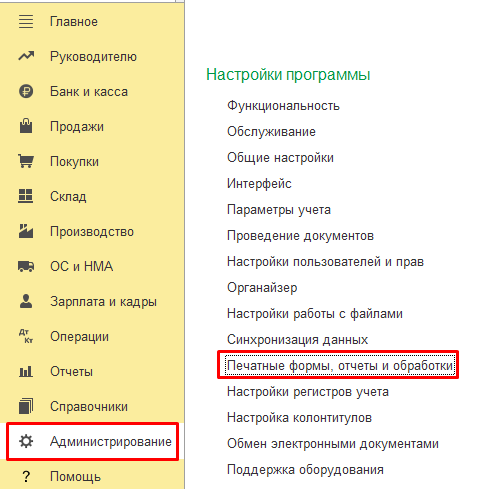
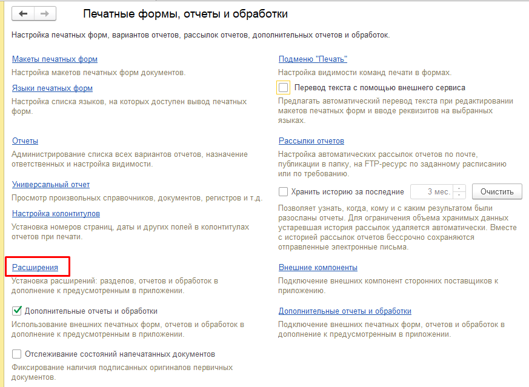

Данный раздел описывает установку модуля **«Алмаз-Онлайн»** в пользовательском режиме, то есть через интерфейс **1С:Предприятие**.

Модуль Алмаз устанавливается как расширение конфигурации из файла `*.cfe`.

---

## Перед началом установки

Перед установкой модуля Алмаз необходимо выполнить подготовительные действия:

1. Попросите остальных пользователей закрыть текущую базу 1С.
2. Убедитесь, что установлены последние обновления конфигурации.
3. Подготовьте файл модуля Алмаз с расширением `*.cfe`.

!!! warning "Важно"
    Во время установки расширения рекомендуется, чтобы другие пользователи не работали в текущей базе 1С.

---

## Переход к расширениям

Для установки модуля выполните следующие действия:

1. Откройте базу 1С в режиме **1С:Предприятие**.

2. Перейдите в раздел **«Администрирование»**.

3. Выберите пункт **«Печатные формы, отчеты и обработки»**.

4. Нажмите на ссылку **«Расширения»**.

---

## Установка нового модуля

Если модуль **«Алмаз-Онлайн»** ранее не устанавливался, нажмите кнопку:

**«Добавить из файла»**

После этого выберите файл модуля Алмаз с расширением `*.cfe`.

---

## Обновление ранее установленного модуля

Если модуль **«Алмаз-Онлайн»** уже присутствует в списке установленных расширений, используйте кнопку:

**«Обновить из файла»**

После этого выберите актуальный файл модуля Алмаз.

!!! info "Примечание"
    Кнопка **«Добавить из файла»** используется при первой установке модуля. Кнопка **«Обновить из файла»** используется при обновлении уже установленного расширения.

---

## Предупреждение безопасности

После выбора файла модуля может открыться окно **«Предупреждение безопасности»**.

В этом окне выберите вариант:

**«Продолжить»**

После этого начнётся процесс установки или обновления расширения.

---

## Отключение безопасного режима

После окончания процесса установки необходимо снять флаг:

**«Безопасный режим»**

Затем нажмите ссылку **«Перезапустить»**, чтобы изменения вступили в силу.

!!! warning "Важно"
    Если не снять флаг **«Безопасный режим»**, работа модуля может быть ограничена.

---

## Перезапуск 1С

После нажатия **«Перезапустить»** программа 1С будет перезапущена.

После повторного запуска в списке разделов должен появиться новый раздел:

**«Алмаз-Онлайн»**

Это означает, что модуль установлен и доступен для дальнейшей настройки.

---

!!! tip "Рекомендация"
    После установки модуля проверьте, что раздел **«Алмаз-Онлайн»** появился в интерфейсе 1С. Если раздел не появился, проверьте список установленных расширений и выполните перезапуск программы.

---

# Установка в сервисе 1С:Фреш

## Особенности установки

Если база 1С работает в сервисе **1С:Фреш**, для установки модуля Алмаз необходимо обратиться к обслуживающей организации.

Пользователь сервиса 1С:Фреш, как правило, не имеет достаточных полномочий для самостоятельной установки расширения.

!!! warning "Важно"
    Установку модуля Алмаз в сервисе **1С:Фреш** должна выполнять обслуживающая организация или специалист, имеющий необходимые права.

---

## Требования при установке

В процессе установки модуля Алмаз, то есть расширения 1С, необходимо выполнить дополнительные настройки:

1. Добавить разрешение на использование интернет-ресурса.
2. Установить переключатель **«Привилегированный режим»** в положение **«Да»**.

---

## Параметры интернет-ресурса

Для работы модуля необходимо разрешить доступ к интернет-ресурсу системы **«Алмаз-Онлайн»**.

| Параметр | Значение |
|---|---|
| **Адрес** | `api.almaz-online.ru` |
| **Протокол** | `https` |
| **Порт** | `443` |

!!! info "Примечание"
    Данный интернет-ресурс используется модулем Алмаз для обмена данными с системой **«Алмаз-Онлайн»**.

---