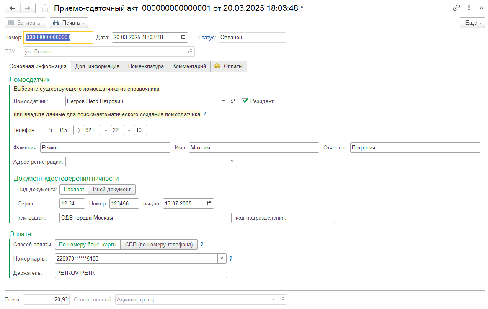

Документ **«Приёмо-сдаточный акт»**, далее **ПСА**, может быть создан:

- с нуля — с помощью кнопки **«Создать»**;
- на основании документа **Поступление товаров / Приобретение товаров**.

Форма документа ПСА используется для заполнения данных ломосдатчика, состава принимаемого лома, выбора способа оплаты и дальнейшей работы с оплатами.

---

## Статус оплаты

В поле **«Статус»** отображается текущий статус оплаты по документу.

Возможные значения:

| Статус | Описание |
|---|---|
| **Создан** | Статус по умолчанию для нового документа, по которому оплата ещё не выполнялась |
| **В обработке** | Заявка на оплату успешно отправлена, но окончательный ответ от банка ещё не получен |
| **Ожидание**| Заявка ожидает подтверждение оплаты |
| **Отменён** | Заявка на оплату была отменена пользователем |
| **Отклонён** | Заявка на оплату была отклонена банком |
| **Оплачен** | Документ успешно оплачен |

!!! info "Примечание"
    Для удобства в списке документов ПСА, а также в списке документов **Поступление товаров / Приобретение товаров**, добавлена колонка с иконкой текущего статуса оплаты.

---

## Вкладки документа ПСА

Окно документа ПСА содержит несколько вкладок:

1. **Основная информация**
2. **Доп. информация**
3. **Номенклатура**
4. **Комментарий**
5. **Оплаты**

---

## Вкладка «Основная информация»

На вкладке **«Основная информация»** вводятся сведения о ломосдатчике.

В этом разделе указываются:

- Ф. И. О. ломосдатчика;
- номер телефона;
- адрес регистрации;
- документ, удостоверяющий личность;
- способ оплаты.

Также на этой вкладке выполняется выбор способа оплаты.

---

## Вкладка «Доп. информация»

Вкладка **«Доп. информация»** используется для ввода дополнительных сведений, которые выводятся в печатную форму ПСА.

Здесь можно указать:

- краткое описание лома;
- основания возникновения права собственности;
- сведения о транспортном средстве;
- сведения о водителе;
- ответственное лицо за приём лома;
- ответственное лицо за проверку на взрывобезопасность;
- ответственное лицо за радиационный контроль.

---

## Вкладка «Номенклатура»

Вкладка **«Номенклатура»** содержит таблицу для ввода состава принимаемого лома.

На этой вкладке указываются позиции номенклатуры, которые входят в приёмо-сдаточный акт.

---

## Вкладка «Комментарий»

Вкладка **«Комментарий»** предназначена для ввода произвольной информации справочного характера.

Поле комментария не является обязательным для заполнения.

---

## Вкладка «Оплаты»

На вкладке **«Оплаты»** отображаются все документы **«Оплата»**, связанные с данным документом ПСА.

Допускается частичная оплата.

В результате с одним документом ПСА могут быть связаны несколько документов **«Оплата»**.

!!! info "Примечание"
    Частичная оплата используется в случаях, когда сумма по одному ПСА оплачивается несколькими платежами.

---
