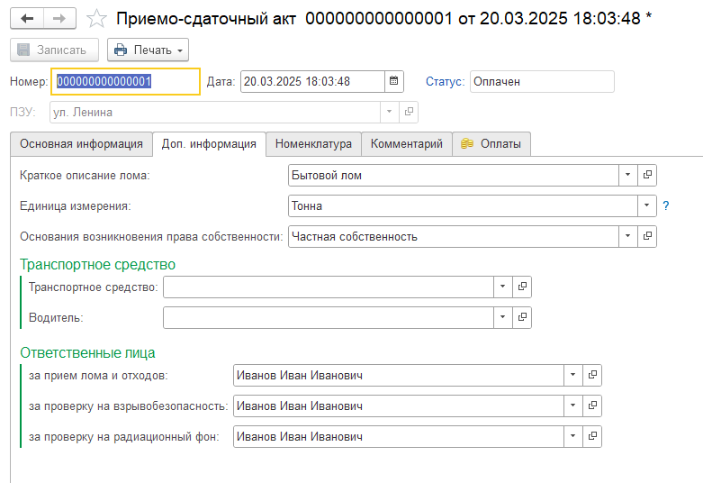

Вкладка **«Доп. информация»** используется для заполнения дополнительных сведений, которые выводятся в печатную форму **Приёмо-сдаточного акта**.

На этой вкладке можно указать сведения о ломе, основания возникновения права собственности, данные транспортного средства, водителя, ответственных лиц и единицу измерения.

---

## Описание лома и основания права собственности

Поля:

- **Краткое описание лома**;
- **Основания возникновения прав собственности**

заполняются автоматически значениями по умолчанию.

При необходимости пользователь может изменить эти значения вручную.

---

## Сведения о транспортном средстве и водителе

При необходимости на вкладке **«Доп. информация»** можно указать сведения:

- о транспортном средстве;
- о водителе.

Эти данные будут выведены в печатную форму **ПСА**.

---

## Ответственные лица

Поля в разделе **«Ответственные лица»** могут быть заполнены автоматически.

Автоматическое заполнение выполняется при условии, что в настройках модуля Алмаз выбрано значение в поле:

**«Ответственное лицо»**

Данные из раздела **«Ответственные лица»** выводятся в печатную форму **Приёмо-сдаточного акта**.

!!! info "Примечание"
    Если ответственные лица не заполнились автоматически, проверьте настройку **«Ответственное лицо»** в настройках модуля Алмаз.

---

## Единица измерения

Отдельное внимание необходимо обратить на поле **«Единица измерения»**.

Весовые показатели в печатной форме ПСА выводятся в соответствии с единицей измерения, выбранной на вкладке **«Доп. информация»**.

Это относится к следующим показателям:

- вес брутто;
- вес тары;
- вес нетто.

Выбранная единица измерения применяется независимо от основной единицы измерения, в которой ведётся учёт номенклатурных позиций в системе Алмаз.

---

## Пример

В базе 1С в качестве основной единицы измерения выбрано значение:

**кг**

Если на вкладке **«Доп. информация»** в поле **«Единица измерения»** выбрать:

**тонны**

то в печатной форме ПСА информация о весе будет выведена в тоннах.

!!! warning "Важно"
    Перед печатью ПСА проверьте значение поля **«Единица измерения»**, чтобы весовые показатели были выведены в нужном формате.

