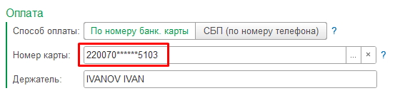

Если ломосдатчик является новым клиентом и отсутствует в справочнике **«Контрагенты»**, данные необходимо заполнить вручную в документе **ПСА**.

Поле **«Ломосдатчик»** в этом случае следует оставить пустым.

---

## Заполнение данных нового ломосдатчика

Для нового ломосдатчика необходимо заполнить остальные поля документа:

- номер телефона;
- фамилию, имя, отчество;
- паспортные данные;
- другие сведения, необходимые для оформления ПСА.

В момент записи документа **ПСА** соответствующий элемент справочника **«Контрагенты»** будет создан автоматически.

!!! info "Примечание"
    Если ломосдатчик отсутствует в справочнике, не нужно предварительно создавать его вручную. Достаточно заполнить данные в документе ПСА, и контрагент будет создан автоматически при записи документа.

---

## Признак «Резидент»

Состояние флага **«Резидент»** определяет, является ли ломосдатчик резидентом Российской Федерации.

Если флаг **«Резидент»** снят, ломосдатчик считается нерезидентом.

Для нерезидента допускается отсутствие следующих данных:

- серия паспорта;
- наименование органа выдачи.

Это связано с тем, что в паспорте гражданина иностранного государства подобная информация может отсутствовать.

!!! warning "Важно"
    При заполнении данных нерезидента проверьте, что флаг **«Резидент»** установлен корректно.

---

## Раздел «Оплата»

В разделе **«Оплата»** необходимо выбрать способ перевода денежных средств.

Доступные варианты:

| Способ оплаты | Описание |
|---|---|
| **По номеру банковской карты** | Перевод денежных средств на банковскую карту ломосдатчика |
| **СБП по номеру телефона** | Перевод денежных средств через Систему быстрых платежей по номеру телефона |

Способ оплаты **«СБП по номеру телефона»** будет доступен только в том случае, если среди подключённых платёжных шлюзов есть шлюзы с поддержкой СБП.

---

## Работа с банковской картой

Процесс выбора и создания банковской карты в документе ПСА упрощён.

---

## Если карта уже сохранена

Если ломосдатчик не является новым клиентом и номер банковской карты уже сохранён в программе, значение в поле **«Номер карты»** будет установлено автоматически при выборе ломосдатчика.

---

## Если у ломосдатчика несколько карт

Если для выбранного ломосдатчика существует несколько банковских карт, введите первые несколько цифр номера карты в поле **«Номер карты»**.

После этого система выполнит автоматический поиск и установит найденное значение.

---

## Если карты нет в базе 1С

Если информация о банковской карте отсутствует в базе 1С, введите номер карты целиком.

Открывать соответствующий справочник вручную не требуется.

В момент записи документа **ПСА** будет автоматически создан новый элемент справочника:

**«Банковские карты контрагентов»**

---

## Поле «Держатель»

Значение в поле **«Держатель»** устанавливается автоматически.

Поле заполняется путём транслитерации имени и фамилии ломосдатчика в латиницу.

!!! info "Примечание"
    Перед проведением оплаты рекомендуется проверить корректность заполнения полей **«Номер карты»** и **«Держатель»**.

---

!!! tip "Рекомендация"
    Перед записью документа проверьте Ф.И.О., паспортные данные, номер телефона и реквизиты оплаты. Эти данные будут использоваться для создания контрагента и проведения выплаты.