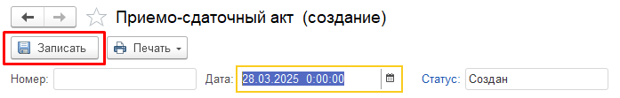
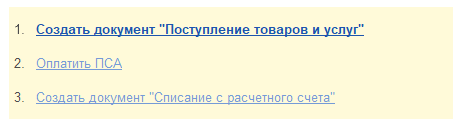
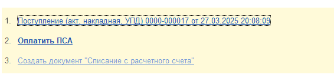
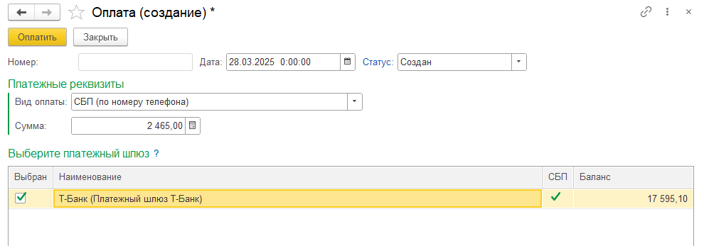
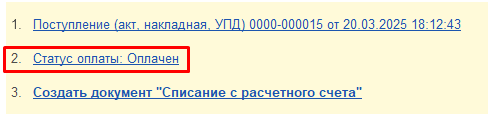
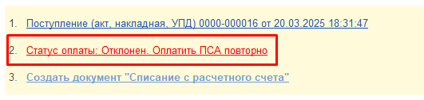

На вкладке **«Номенклатура»** необходимо ввести информацию о составе, объёме и стоимости принимаемого лома.

Если данные по номенклатуре не заполнены, документ **ПСА** записать не удастся.

После завершения ввода данных нажмите кнопку **«Записать»** в верхней части окна документа.

---

## Запись документа ПСА

В момент записи документа выполняется проверка полноты и корректности введённых данных.

Если проверка прошла успешно:

- документ **ПСА** будет записан в базе 1С;
- в системе **«Алмаз-Онлайн»** будет создан платёжный документ;
- в нижней части формы документа появится панель дальнейших действий.

---

## Создание документа поступления

После успешной записи ПСА в нижней панели станет доступна ссылка:

**«Создать документ “Поступление товаров и услуг”»**

При нажатии на эту ссылку будет автоматически создан и открыт документ **«Поступление товаров и услуг»**.

Все поля нового документа будут автоматически заполнены данными из документа **ПСА**.

После проверки документа **«Поступление товаров»** нажмите кнопку:

**«Провести и закрыть»**

После этого в документе ПСА станет доступна ссылка **«Оплатить ПСА»**.

---

## Создание документа «Оплата»

Для создания документа оплаты нажмите ссылку **«Оплатить ПСА»**.

После нажатия будет создан документ **«Оплата»**.

Все поля документа заполняются автоматически, в том числе поле **«Сумма»**. Значение суммы копируется из документа **ПСА**.

При необходимости сумму можно изменить, если оплату требуется выполнить несколькими частями.

!!! info "Примечание"
    Программа контролирует размер задолженности перед ломосдатчиком. Если сумма оплаты превышает текущий размер задолженности, на экран будет выведено предупреждение.

---

## Выбор платёжного шлюза

В документе **«Оплата»** отображается таблица доступных платёжных шлюзов.

Чтобы выбрать шлюз для оплаты, установите флаг в колонке **«Выбран»**.

При выборе шлюза необходимо учитывать текущий баланс. Баланс выбранного шлюза не должен быть меньше суммы оплаты.

Если баланс выбранного шлюза меньше суммы оплаты, программа выведет предупреждающее сообщение.

!!! info "Примечание"
    Если доступен только один платёжный шлюз и его баланс равен сумме оплаты или превышает её, флаг **«Выбран»** будет установлен автоматически.

---

## Отправка заявки на оплату

После выбора платёжного шлюза нажмите кнопку **«Оплатить»**.

При успешной отправке заявки на перевод статус документа **«Оплата»** изменится на:

**«В обработке»**

Если в настройках модуля Алмаз установлены флаги:

- **«Включить автоматическое обновление статусов»**;
- **«Показывать оповещения»**,

программа 1С будет автоматически отслеживать текущий статус платежа и выводить уведомления пользователю.

---

## Успешная оплата

После успешного выполнения оплаты текст ссылки в нижней панели документа **ПСА** будет изменён.

Это означает, что оплата по документу выполнена успешно.

---

## Отклонение заявки банком

Заявка на оплату может быть отклонена банком по разным причинам.

Например, причиной может быть неверно указанный номер карты.

В этом случае в нижней панели документа **ПСА**:

- ссылка оплаты изменит цвет на красный;
- текст ссылки изменится на **«Статус оплаты: Отклонен. Оплатить ПСА повторно»**.

Для повторной оплаты необходимо:

1. Исправить данные в документе ПСА, например номер карты.
2. Повторно записать документ ПСА.
3. Нажать ссылку **«Оплатить ПСА повторно»**.
4. Создать новый документ **«Оплата»**.
5. Повторно отправить заявку на оплату.

---

!!! warning "Важно"
    Перед отправкой заявки на оплату проверьте сумму, номер карты, держателя карты и выбранный платёжный шлюз.