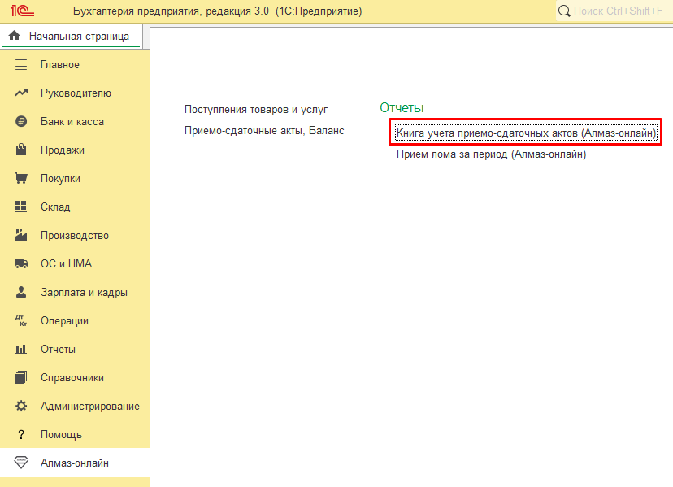

Для подготовки реестра приёмо-сдаточных актов в электронном виде в модуле Алмаз предусмотрен отдельный отчёт.

Отчёт доступен в разделе **«Алмаз-Онлайн»**.

---

## Где находится отчёт

Чтобы открыть отчёт, перейдите в раздел:

**Алмаз-Онлайн → Реестр приёмо-сдаточных актов**

Название пункта может отличаться в зависимости от версии модуля и используемой конфигурации 1С.

---

## Для чего используется отчёт

Отчёт используется для формирования электронного реестра ПСА.

С его помощью можно подготовить список приёмо-сдаточных актов за выбранный период и использовать его для дальнейшей обработки, проверки или передачи ответственным сотрудникам.

---

!!! info "Примечание"
    Реестр формируется на основании документов ПСА, созданных или загруженных в информационную базу 1С.