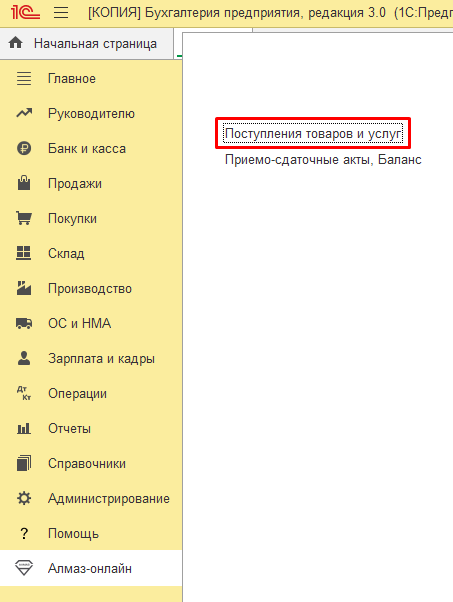
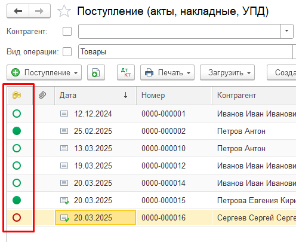

Документы **«Поступление товаров»** или **«Приобретение товаров»** используются для отражения поступления лома в учёте 1С.

Название документа зависит от используемой конфигурации 1С.

---

## Открытие списка документов

Для удобства ссылка для открытия списка документов поступления добавлена в раздел **«Алмаз-Онлайн»**.

Пользователь может перейти к списку документов поступления напрямую из раздела модуля Алмаз.

---

## Отображение статуса оплаты

В левой части таблицы документов добавлена отдельная колонка.

В этой колонке отображается иконка, которая показывает текущий статус оплаты, связанной с данным документом.

Это позволяет быстро определить состояние оплаты без открытия самого документа.

---

## Для чего используется колонка статуса

Колонка со статусом помогает пользователю:

- быстро увидеть, выполнена ли оплата;
- определить документы, которые находятся в обработке;
- увидеть документы с отклонённой оплатой;
- быстрее перейти к документам, требующим внимания.

!!! info "Примечание"
    Иконка в списке документов отражает текущий статус оплаты, связанной с документом **«Поступление товаров»** или **«Приобретение товаров»**.

---