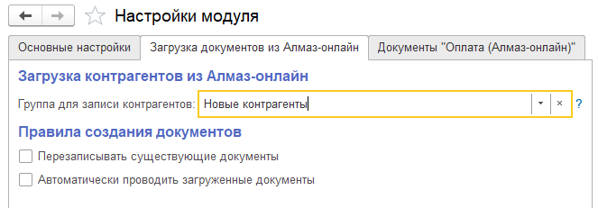

Вкладка **«Загрузка документов из Алмаз-Онлайн»** используется для настройки правил загрузки документов и связанных справочников из системы **«Алмаз-Онлайн»** в информационную базу 1С.

Настройки на данной вкладке определяют, куда будут записываться загруженные контрагенты, как обрабатывать ранее загруженные документы и нужно ли автоматически проводить документы после загрузки.

---

## Основные настройки

| Настройка | Описание |
|---|---|
| **Группа для записи контрагентов** | Указывает группу справочника **«Контрагенты»**, в которую будут автоматически помещаться новые контрагенты, созданные при загрузке из системы **«Алмаз-Онлайн»** |
| **Перезаписывать существующие документы** | Если флаг установлен, ранее загруженные документы **«Поступление/Приобретение»** будут перезаписываться при повторной загрузке данных |
| **Автоматически проводить загруженные документы** | Если флаг установлен, загруженные документы будут автоматически проводиться после загрузки |

---

## Группа для записи контрагентов

Поле **«Группа для записи контрагентов»** определяет, в какую группу справочника **«Контрагенты»** будут записываться новые элементы, созданные в процессе загрузки из системы **«Алмаз-Онлайн»**.

Если при загрузке документов в 1С будет создан новый контрагент, он автоматически попадёт в указанную группу.

!!! tip "Рекомендация"
    Для удобства учёта можно создать отдельную группу, например **«Контрагенты Алмаз-Онлайн»**, и указать её в данной настройке.

---

## Перезаписывать существующие документы

Флаг **«Перезаписывать существующие документы»** определяет поведение системы при повторной загрузке данных из **«Алмаз-Онлайн»**.

Если флаг установлен, ранее загруженные документы:

- **«Поступление товаров и услуг»**;
- **«Приобретение товаров и услуг»**;

будут перезаписываться при повторной загрузке.

Если флаг не установлен, существующие документы не будут автоматически изменяться при повторной загрузке.

!!! warning "Важно"
    Используйте перезапись документов осторожно. Если в ранее загруженный документ были внесены ручные изменения, при повторной загрузке они могут быть потеряны.

---

## Автоматически проводить загруженные документы

Флаг **«Автоматически проводить загруженные документы»** определяет, нужно ли автоматически проводить документы после загрузки из системы **«Алмаз-Онлайн»**.

Если флаг установлен, после загрузки документы будут автоматически проведены в 1С.

Если флаг не установлен, документы будут загружены, но пользователь должен будет провести их вручную.

!!! info "Примечание"
    Автоматическое проведение удобно использовать, если загружаемые документы не требуют дополнительной проверки или ручной корректировки.

---

!!! tip "Рекомендация"
    Если загруженные документы требуется проверять перед проведением, не включайте автоматическое проведение. В этом случае пользователь сможет проверить документ и провести его вручную.