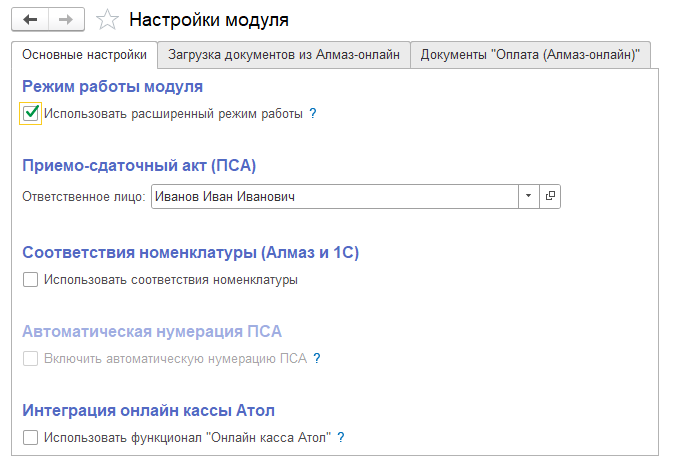
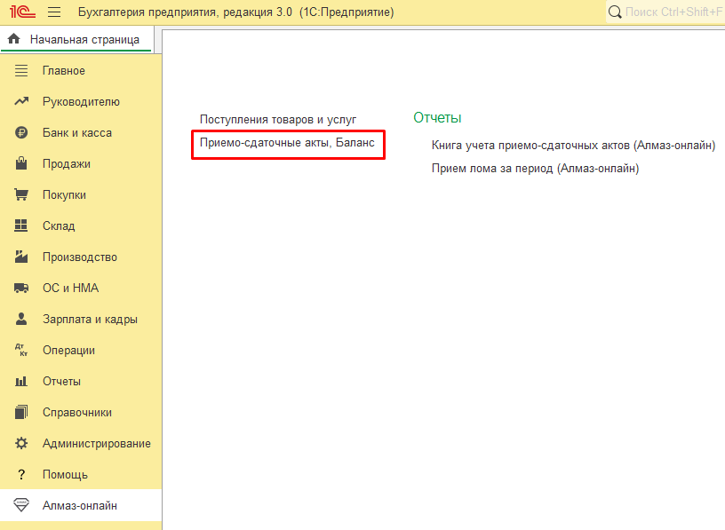
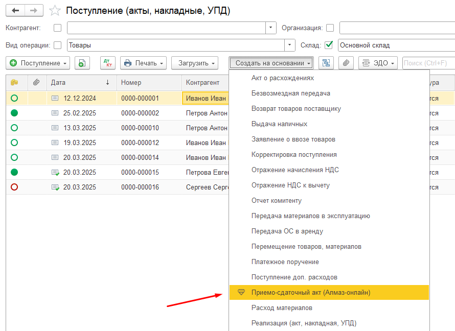

Расширенный режим работы модуля Алмаз соответствует **сценарию № 2**.

В этом режиме вся работа выполняется непосредственно в информационной базе **1С**.

Ключевым документом является:

**«ПСА (Приёмо-сдаточный акт)»**

Документ **«ПСА»** выполняет роль единого окна, в котором пользователь может выполнить все необходимые действия:

- подготовить приёмо-сдаточный акт;
- сформировать документ поступления для отражения прихода лома по бухгалтерскому учёту;
- провести оплату ломосдатчику на банковскую карту;
- провести оплату через **СБП**, то есть Систему быстрых платежей.

---

## Включение расширенного режима

Чтобы активировать расширенный режим работы, необходимо перейти в настройки модуля и установить флаг:

**«Использовать расширенный режим работы»**

После включения этого флага модуль начнёт работать по расширенному сценарию.

!!! warning "Важно"
    Перед включением расширенного режима убедитесь, что организация планирует выполнять работу с ПСА, поступлениями и оплатами непосредственно в 1С.

---

## Изменения в интерфейсе после включения режима

После включения расширенного режима интерфейс модуля изменится.

В системе появятся дополнительные настройки, разделы и команды.

---

## Расширение списка настроек

В окне настроек модуля появятся дополнительные элементы:

| Элемент | Назначение |
|---|---|
| **Интеграция онлайн-кассы Атол** | Настройка использования онлайн-кассы Атол при работе с платежами |
| **Документы Оплата (Алмаз-Онлайн)** | Вкладка с настройками документов оплаты и интеграции с системой Алмаз-Онлайн |

!!! info "Примечание"
    Состав настроек может отличаться в зависимости от конфигурации 1С и версии установленного модуля.

---

## Новые пункты в разделе «Алмаз-Онлайн»

В разделе **«Алмаз-Онлайн»** появятся дополнительные пункты:

- **Приёмо-сдаточные акты**;
- **Баланс**.

Пункт **«Приёмо-сдаточные акты»** используется для работы с документами ПСА.

Пункт **«Баланс»** используется для просмотра доступных сумм по подключённым платёжным шлюзам.

---

## Создание ПСА на основании поступления

В списке документов **«Поступление»** будет добавлен пункт меню для создания документа:

**«Приёмо-сдаточный акт»**

Документ ПСА можно создать на основании приходного документа.

Это позволяет связать отражение поступления лома в 1С с оформлением ПСА и последующей оплатой ломосдатчику.

---

## Основные возможности расширенного режима

В расширенном режиме пользователь может выполнять следующие действия непосредственно в 1С:

| Действие | Описание |
|---|---|
| Подготовка ПСА | Создание и заполнение приёмо-сдаточного акта |
| Печать ПСА | Формирование печатной формы приёмо-сдаточного акта |
| Создание поступления | Отражение прихода лома по бухгалтерскому учёту |
| Оплата на карту | Проведение выплаты по номеру банковской карты |
| Оплата через СБП | Проведение выплаты через Систему быстрых платежей |
| Просмотр баланса | Проверка доступной суммы по подключённым шлюзам |

---

!!! tip "Рекомендация"
    После включения расширенного режима рекомендуется перезапустить 1С и проверить, что все новые пункты меню и настройки отображаются корректно.