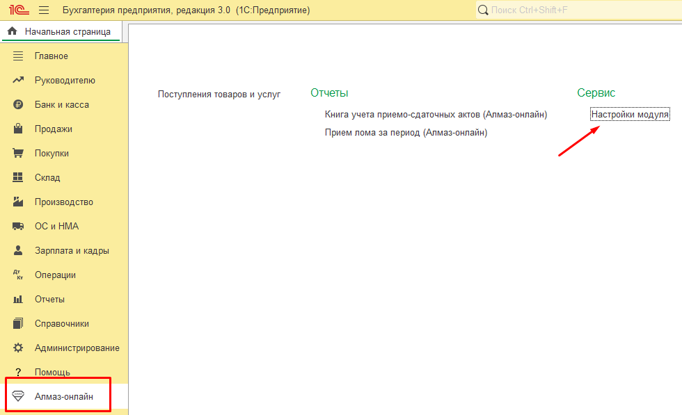
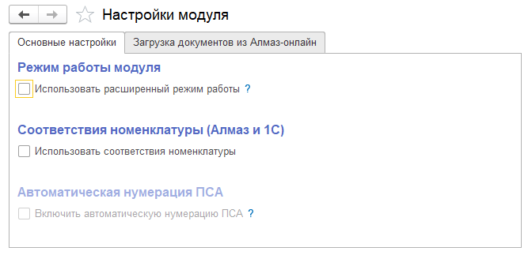
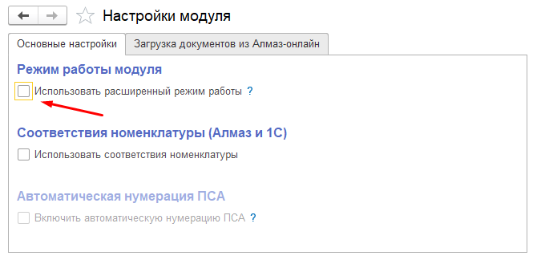

Параметры работы модуля **Алмаз** задаются в настройках модуля 1С.

Настройки позволяют определить режим работы модуля, сценарий обмена данными между 1С и системой **«Алмаз-Онлайн»**, а также параметры интеграции.

---

## Переход к настройкам модуля

Для перехода к настройкам выполните следующие действия:

1. Откройте базу 1С в пользовательском режиме.
2. Перейдите в раздел **«Алмаз-Онлайн»**.
3. Нажмите ссылку **«Настройки модуля»**.

После этого откроется окно настроек модуля.

!!! info "Примечание"
    Состав элементов в окне настроек может отличаться в зависимости от выбранного режима работы модуля.

---

## Режимы работы модуля

Ранее были описаны два основных сценария совместного использования системы **«Алмаз-Онлайн»** и программы 1С:

| Сценарий | Режим работы | Описание |
|---|---|---|
| **Сценарий № 1** | Упрощённый режим | Данные вводятся в системе **«Алмаз-Онлайн»**, затем загружаются в 1С |
| **Сценарий № 2** | Расширенный режим | Данные вводятся и обрабатываются в 1С, взаимодействие с системой **«Алмаз-Онлайн»** автоматизировано |

---

## Упрощённый режим работы

По умолчанию модуль работает в **упрощённом режиме**.

В этом режиме предполагается, что данные вводятся непосредственно в системе **«Алмаз-Онлайн»**.

Затем данные загружаются в 1С в виде документов:

- **Поступление товаров и услуг**;
- **Приобретение товаров и услуг**.

!!! tip "Рекомендация"
    Упрощённый режим подходит, если пользователи на пунктах приёма работают через веб-интерфейс **«Алмаз-Онлайн»**, а 1С используется для последующей загрузки и учёта документов.

---

## Расширенный режим работы

Расширенный режим используется, если работа с документами и платежами должна выполняться непосредственно в программе 1С.

Чтобы активировать расширенный режим, необходимо установить флаг:

**«Использовать расширенный режим работы»**

После включения этого флага модуль начнёт работать по сценарию № 2.

!!! warning "Важно"
    После изменения режима работы проверьте доступность нужных функций и корректность настроек обмена данными.

---

!!! tip "Рекомендация"
    Перед включением расширенного режима убедитесь, что организация действительно планирует выполнять ввод данных, формирование ПСА и проведение платежей непосредственно в 1С.