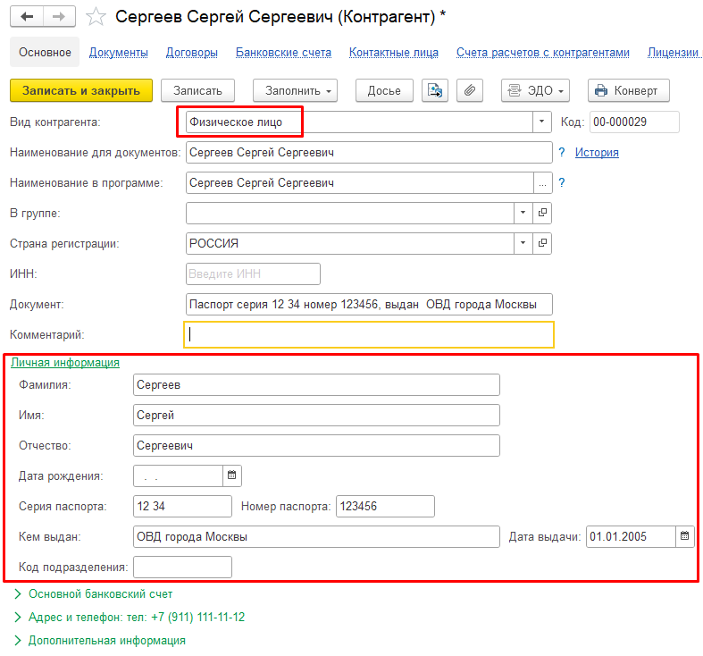

Модуль Алмаз работает по принципу двусторонней синхронизации данных между системой **«Алмаз-Онлайн»** и информационной базой **1С**.

Созданные в системе **«Алмаз-Онлайн»** платёжные документы могут быть загружены в 1С в виде документов:

- **Поступление товаров и услуг**;
- **Приобретение товаров и услуг**.

С другой стороны, запись документа **«ПСА»** в базе 1С сопровождается автоматическим созданием платёжного документа в системе **«Алмаз-Онлайн»**.

---

## Синхронизируемые справочники

При работе модуля используются справочники, которые существуют как в базе 1С, так и в системе **«Алмаз-Онлайн»**.

| Объект | Справочник |
|---|---|
| Ломосдатчик | **Контрагенты** |
| Принимаемый лом | **Номенклатура** |

Так как данные справочники существуют в обеих системах, их содержимое должно синхронизироваться.

!!! info "Примечание"
    Синхронизация справочников позволяет корректно связывать документы, контрагентов и номенклатуру между 1С и системой **«Алмаз-Онлайн»**.

---

## Справочник «Номенклатура»

Синхронизация элементов справочника **«Номенклатура»** выполняется разными способами.

Способ синхронизации зависит от состояния флага:

**«Использовать соответствия номенклатуры»**

---

## Сценарий № 1 — данные вводятся в Алмаз-Онлайн

При сценарии № 1 данные вводятся в системе **«Алмаз-Онлайн»**, а затем загружаются в 1С в виде документов **Поступление/Приобретение**.

### Если флаг не установлен

Если флаг **«Использовать соответствия номенклатуры»** не установлен, то при загрузке платёжных документов из системы **«Алмаз-Онлайн»** в базу 1С поиск элемента справочника **«Номенклатура»** выполняется по наименованию.

Если поиск завершился неудачей, в базе 1С будет автоматически создан новый элемент справочника **«Номенклатура»**.

### Если флаг установлен

Если флаг **«Использовать соответствия номенклатуры»** установлен, можно настроить соответствия между элементами справочника **«Номенклатура»** в системе **«Алмаз-Онлайн»** и в базе 1С.

В этом случае элементы справочника, загруженные из системы **«Алмаз-Онлайн»**, будут заменены на номенклатурные позиции, указанные в таблице соответствия.

!!! tip "Рекомендация"
    Используйте соответствия номенклатуры, если в 1С уже заведены нужные элементы справочника и необходимо избежать создания дублей.

---

## Сценарий № 2 — данные вводятся в 1С

При сценарии № 2 ввод данных выполняется непосредственно в базе 1С.

### Если флаг не установлен

Если флаг **«Использовать соответствия номенклатуры»** не установлен, и соответствующий элемент справочника **«Номенклатура»** отсутствует в системе **«Алмаз-Онлайн»**, он будет создан автоматически.

### Если флаг установлен

Если флаг **«Использовать соответствия номенклатуры»** установлен, будет использована номенклатурная позиция, указанная в таблице соответствия.

---

## Краткое сравнение работы флага

| Сценарий | Флаг не установлен | Флаг установлен |
|---|---|---|
| **Сценарий № 1** — данные из Алмаз-Онлайн загружаются в 1С | Поиск номенклатуры в 1С выполняется по наименованию. Если элемент не найден, он создаётся автоматически | Номенклатура из Алмаз-Онлайн заменяется на позицию, указанную в таблице соответствия |
| **Сценарий № 2** — данные вводятся в 1С | Если номенклатура отсутствует в Алмаз-Онлайн, она создаётся автоматически | Используется позиция, указанная в таблице соответствия |

---

## Справочник «Контрагенты»

В процессе загрузки данных из системы **«Алмаз-Онлайн»** в базу 1С выполняется поиск элемента справочника **«Контрагенты»**.

Поиск выполняется по совокупности значений, если они заполнены:

- ИНН;
- ФИО;
- серия паспорта;
- номер паспорта.

Если поиск завершился неудачей, соответствующий элемент справочника **«Контрагенты»** будет автоматически создан в базе 1С.

---

## Группа для записи контрагентов

Если в настройках модуля выбрана группа справочника **«Контрагенты»**, новые созданные элементы будут размещены в указанной группе.

Данная настройка задаётся в поле:

**«Группа для записи контрагентов»**

!!! info "Примечание"
    Группа для записи контрагентов помогает отделить контрагентов, загруженных из системы **«Алмаз-Онлайн»**, от остальных элементов справочника.

---

## Особенность конфигурации БП

В конфигурациях:

- **Управление торговлей, УТ**;
- **Управление нашей фирмой, УНФ**;
- **Комплексная автоматизация, КА**;

серия, номер паспорта и другая личная информация вводятся в отдельные поля.

В конфигурации **Бухгалтерия предприятия, БП** такая возможность в типовом варианте отсутствует.

В связи с этим в карточку контрагента в конфигурации **БП** добавлен раздел:

**«Личная информация»**

Раздел добавляется для элемента с видом:

**«Физическое лицо»**

---

## Синхронизация личной информации

В процессе загрузки данных из системы **«Алмаз-Онлайн»** в базу 1С поля раздела **«Личная информация»** заполняются автоматически.

При работе в расширенном режиме, то есть по сценарию № 2, паспортные данные из базы 1С выгружаются в карточку контрагента в системе **«Алмаз-Онлайн»**.

Таким образом выполняется двусторонняя синхронизация данных:

- из системы **«Алмаз-Онлайн»** в 1С;
- из 1С в систему **«Алмаз-Онлайн»**.

!!! warning "Важно"
    Для корректной синхронизации контрагентов рекомендуется заполнять идентифицирующие данные максимально полно: ФИО, ИНН при наличии, серию и номер паспорта.

---

!!! tip "Рекомендация"
    Перед началом активного обмена данными настройте соответствия номенклатуры. Это поможет избежать дублей и упростит дальнейшую работу с документами.