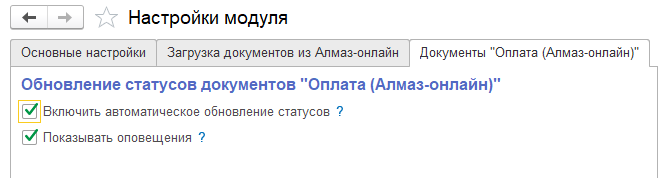

Вкладка **«Документы “Оплата (Алмаз-Онлайн)”»** используется для настройки параметров работы с документами оплаты в модуле Алмаз.

Эти настройки применяются при отправке заявок на оплату, обновлении статусов платежей, выводе уведомлений пользователю, печати ПСА и использовании дополнительных функций, таких как соответствия номенклатуры и интеграция с онлайн-кассой Атол.

---

## Рекомендуемые настройки

Для повышения удобства использования модуля рекомендуется установить оба флага:

- **«Включить автоматическое обновление статусов»**;
- **«Показывать оповещения»**.

Эти настройки позволяют автоматически отслеживать изменение статуса оплаты и уведомлять пользователя о результате.

!!! tip "Рекомендация"
    Рекомендуется включить автоматическое обновление статусов и показ оповещений, чтобы пользователю не приходилось вручную проверять состояние оплаты.

---

## Описание настроек

| Настройка | Описание |
|---|---|
| **Включить автоматическое обновление статусов** | Если флаг установлен, после отправки заявки на оплату статус документа **«Оплата»** будет обновляться автоматически |
| **Показывать оповещения** | Если флаг установлен, при изменении статуса оплаты на экран будет выводиться стандартное оповещение пользователя в правом нижнем углу окна программы 1С |
| **Ответственное лицо** | Сотрудник, ФИО которого будет выводиться в печатную форму ПСА в качестве ответственного лица |
| **Использовать соответствия номенклатуры** | Если настройка активирована, появляется возможность настроить соответствия позиций справочника **«Номенклатура»** в системе **«Алмаз-Онлайн»** и в базе 1С |
| **Использовать функционал “Онлайн касса Атол”** | Включает интеграцию с Атол для отправки электронного чека после выполнения перевода средств на карту ломосдатчика |

---

## Включить автоматическое обновление статусов

Флаг **«Включить автоматическое обновление статусов»** отвечает за автоматическое обновление статуса оплаты.

Если флаг установлен, после отправки заявки на оплату по документу **«Оплата»** модуль будет автоматически проверять и обновлять статус платежа.

Это позволяет пользователю видеть актуальное состояние оплаты без ручного обновления.

!!! info "Примечание"
    Автоматическое обновление статусов удобно использовать при регулярной работе с выплатами, так как статус платежа может изменяться после обработки системой банка.

---

## Показывать оповещения

Флаг **«Показывать оповещения»** отвечает за вывод уведомлений пользователю.

Если флаг установлен, при изменении статуса оплаты на экран будет выводиться стандартное оповещение 1С.

Оповещение отображается в правом нижнем углу окна программы 1С.

!!! info "Пример"
    Если статус оплаты изменился, пользователь увидит уведомление без необходимости вручную открывать документ и проверять его состояние.

---

## Ответственное лицо

Поле **«Ответственное лицо»** заполняется значением из справочника **«Сотрудники»**.

ФИО выбранного сотрудника будет выводиться в печатную форму **ПСА**, то есть приёмо-сдаточного акта.

Ответственное лицо указывается в документе как лицо, ответственное за:

- приём лома и отходов;
- проверку лома и отходов на взрывобезопасность;
- радиационный контроль лома и отходов.

!!! warning "Важно"
    Перед печатью ПСА проверьте, что в поле **«Ответственное лицо»** выбран корректный сотрудник.

---

## Использовать соответствия номенклатуры

Флаг **«Использовать соответствия номенклатуры»** включает возможность настройки соответствий между позициями справочника **«Номенклатура»** в системе **«Алмаз-Онлайн»** и в информационной базе 1С.

Если настройка активирована, пользователь может указать, какая номенклатурная позиция из системы **«Алмаз-Онлайн»** должна соответствовать позиции в базе 1С.

Это помогает избежать дублей и корректно сопоставлять позиции при обмене данными.

!!! tip "Рекомендация"
    Используйте соответствия номенклатуры, если в 1С уже заведены номенклатурные позиции и необходимо использовать именно их при загрузке или выгрузке документов.

Подробнее настройка соответствий описана в разделе **«Соответствия номенклатуры»**.

---

## Использовать функционал «Онлайн касса Атол»

Флаг **«Использовать функционал “Онлайн касса Атол”»** включает интеграцию с системой Атол.

Интеграция используется для отправки электронного чека после выполнения перевода средств на карту ломосдатчика.

После включения функционала необходимо пройти авторизацию в системе Атол и выбрать основную ККТ.

!!! info "Примечание"
    Настройка интеграции с Атол описана в разделе **«Интеграция онлайн-кассы Атол»**.

---

!!! warning "Важно"
    После изменения настроек рекомендуется проверить работу модуля на тестовом документе: отправку оплаты, обновление статуса, вывод оповещения и печатную форму ПСА.