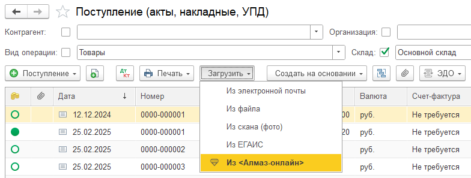

Упрощённый режим работы модуля Алмаз соответствует **сценарию № 1**.

В этом режиме данные вводятся в системе **«Алмаз-Онлайн»**, а затем загружаются в информационную базу 1С в виде документов поступления.

Название документа может отличаться в зависимости от используемой конфигурации 1С.

Например:

- **Поступление товаров и услуг**;
- **Приобретение товаров и услуг**.

---

## Общий принцип работы

При работе в упрощённом режиме пользователь оформляет платёжные документы в системе **«Алмаз-Онлайн»**.

После этого документы загружаются в 1С через механизм загрузки из системы **«Алмаз-Онлайн»**.

Вместе с документами могут автоматически загружаться связанные элементы справочников, например:

- **Контрагенты**;
- **Номенклатура**.

!!! info "Примечание"
    Упрощённый режим используется по умолчанию после установки модуля Алмаз.

---

## Загрузка документов из Алмаз-Онлайн

Для загрузки документов в списке документов поступлений добавлен пункт:

**«Из Алмаз-Онлайн»**

Он находится в меню:

**«Загрузить»**

Для загрузки выполните следующие действия:

1. Откройте список документов поступлений в 1С.
2. Нажмите меню **«Загрузить»**.
3. Выберите пункт **«Из Алмаз-Онлайн»**.
4. Укажите период загрузки.
5. Запустите загрузку документов.

После выбора периода модуль создаст документы поступления на основе платёжных документов, введённых в системе **«Алмаз-Онлайн»**.

---

## Автоматическая загрузка справочников

При загрузке документов элементы соответствующих справочников загружаются автоматически.

К таким справочникам относятся:

| Справочник | Описание |
|---|---|
| **Контрагенты** | Данные ломосдатчиков или связанных участников документов |
| **Номенклатура** | Позиции, используемые в приёмо-сдаточных актах и документах поступления |

!!! tip "Рекомендация"
    После первой загрузки документов рекомендуется проверить автоматически созданные элементы справочников, чтобы убедиться в корректности наименований и реквизитов.

---

## Соответствие номенклатуры

В модуле предусмотрена возможность установить соответствия между элементами справочника **«Номенклатура»** в системе **«Алмаз-Онлайн»** и в базе 1С.

Это позволяет корректно сопоставлять позиции документов при загрузке.

Подробнее настройка соответствий описана в отдельном разделе:

**«Соответствие номенклатуры»**

---

!!! warning "Важно"
    Перед загрузкой документов убедитесь, что выбран корректный период. Это поможет избежать пропуска нужных документов или повторной загрузки лишних данных.