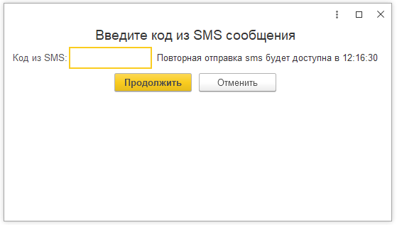

Работа с модулем **Алмаз** начинается с процедуры авторизации.

Авторизация необходима для подключения модуля 1С к системе **«Алмаз-Онлайн»** и выполнения операций обмена данными, загрузки документов, работы с ПСА и проведения оплат.

Для входа используются те же логин и пароль, которые применяются для входа на сайт **«Алмаз-Онлайн»**.

---

## Когда требуется авторизация

Необходимость выполнения авторизации возникает, если истёк срок действия предыдущей авторизации.

Авторизация может потребоваться в следующих случаях:

| Режим работы | Когда требуется авторизация |
|---|---|
| **Упрощённый режим** | Перед загрузкой документов из системы **«Алмаз-Онлайн»** в списке документов поступлений |
| **Расширенный режим** | При открытии основного окна **«Приёмо-сдаточные акты, Баланс»** в разделе **«Алмаз-Онлайн»** |
| **Любой режим** | В иных случаях, когда программа 1С взаимодействует с системой **«Алмаз-Онлайн»**, а срок предыдущей авторизации истёк |

!!! info "Примечание"
    Если авторизация была выполнена ранее и срок её действия ещё не истёк, повторный ввод логина и пароля может не потребоваться.

---

## Авторизация в упрощённом режиме

При использовании модуля в упрощённом режиме, когда флаг **«Использовать расширенный режим работы»** снят, авторизация выполняется перед загрузкой документов из системы **«Алмаз-Онлайн»**.

Обычно авторизация запрашивается при выборе загрузки документов в списке документов поступлений.

---

## Авторизация в расширенном режиме

При использовании модуля в расширенном режиме авторизация может потребоваться:

- при открытии окна **«Приёмо-сдаточные акты, Баланс»**;
- при выполнении операций обмена с системой **«Алмаз-Онлайн»**;
- при проведении действий, для которых требуется подключение к системе;
- если срок предыдущей авторизации истёк.

---

## Вход по логину и паролю

Для выполнения авторизации:

1. Введите логин.
2. Введите пароль.
3. Нажмите кнопку **«Выполнить вход»**.

Логин и пароль используются те же, что и для входа на сайт **«Алмаз-Онлайн»**.

!!! warning "Важно"
    Не передавайте логин и пароль третьим лицам. Учётные данные используются для доступа к системе **«Алмаз-Онлайн»** и операциям, доступным пользователю.

---

## Подтверждение входа по SMS

Если логин и пароль введены верно, на номер телефона пользователя будет отправлено SMS с кодом подтверждения.

Для завершения авторизации:

1. Получите SMS с кодом подтверждения.
2. Введите код в открывшемся окне.
3. Подтвердите вход.

После успешного подтверждения модуль продолжит выполнение операции.

!!! info "Примечание"
    Код подтверждения отправляется на номер телефона, связанный с учётной записью пользователя в системе **«Алмаз-Онлайн»**.

---

## Выбор ранее авторизованной учётной записи

Если процедура авторизации была пройдена ранее и срок её действия ещё не истёк, пользователю будет доступна таблица для выбора учётной записи.

В этом случае можно:

1. Выбрать нужную учётную запись из таблицы.
2. Нажать кнопку **«Выбрать и продолжить»**.

После этого выбранная учётная запись будет активирована для дальнейшей работы.

---

## Вход с другими учётными данными

Если необходимо войти под другим пользователем:

1. Откройте раздел **«Выполните вход с другими учётными данными»**.
2. Введите логин.
3. Введите пароль.
4. Нажмите кнопку **«Выполнить вход»**.
5. При необходимости подтвердите вход SMS-кодом.

---
