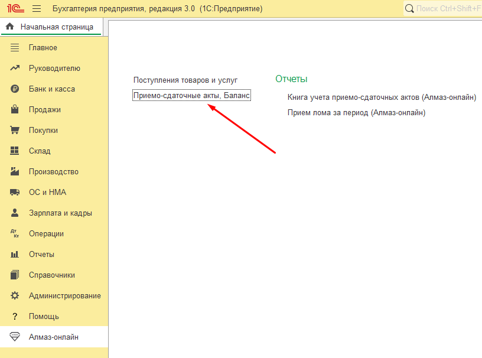
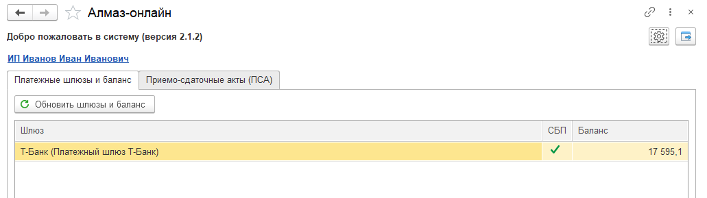

# Документ «Приёмо-сдаточный акт»

## Назначение

Документ **«Приёмо-сдаточный акт»**, далее **ПСА**, является ключевым документом модуля Алмаз.

ПСА выполняет роль единого окна, в котором совершаются все необходимые действия:

- подготовка приёмо-сдаточного акта;
- создание документа поступления для отражения прихода лома по бухгалтерскому учёту;
- проведение оплаты на карту ломосдатчика;
- проведение оплаты через **СБП**.

Документ ПСА может быть создан:

- с нуля;
- на основании документа **Поступление/Приобретение**.

!!! info "Примечание"
    Создание ПСА на основании документа **Поступление/Приобретение** доступно только в расширенном режиме работы модуля Алмаз.

---

## Создание ПСА с нуля

Работа с документами ПСА осуществляется на одноимённой вкладке в основном окне модуля Алмаз.

Чтобы открыть основное окно, в разделе **«Алмаз-Онлайн»** нажмите ссылку:

**«Приёмо-сдаточные акты, Баланс»**

Основное окно содержит две вкладки:

- **Платёжные шлюзы и баланс**;
- **Приёмо-сдаточные акты (ПСА)**.

---

## Платёжные шлюзы и баланс

На вкладке **«Платёжные шлюзы и баланс»** выводятся все платёжные шлюзы, а также текущий баланс каждого шлюза.

Кнопка **«Обновить шлюзы и баланс»** служит для принудительного обновления данных.

---

## Создание ПСА на основании документа Поступление/Приобретение

В версии **2.x** документ ПСА является единым окном, в котором выполняются остальные операции.

При этом для сохранения совместимости с предыдущей версией модуля, а также для дополнительного удобства и гибкости использования, документ ПСА может быть создан на основании документа:

- **Поступление товаров**;
- **Приобретение товаров**;

Название документа зависит от используемой конфигурации 1С.

При создании ПСА на основании документа **Поступление/Приобретение** поля документа ПСА автоматически заполняются соответствующими данными, насколько это возможно.

Например, паспортные данные в конфигурации **БП**, то есть **Бухгалтерия предприятия**, будут заполнены при условии, что соответствующая информация присутствует в карточке контрагента в разделе **«Личная информация»**.

!!! warning "Важно"
    Создание ПСА на основании документа **Поступление/Приобретение** доступно только в расширенном режиме работы модуля Алмаз.

