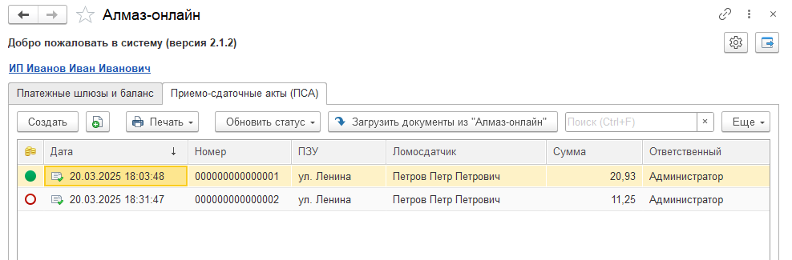
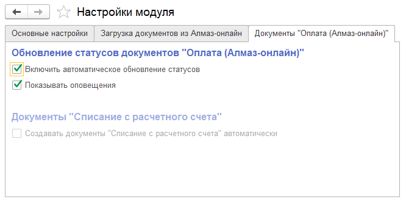

На вкладке **«Приёмо-сдаточные акты (ПСА)»** осуществляется работа с документами ПСА.

Здесь отображается список документов, которые были:

- созданы в модуле Алмаз;
- загружены из системы **«Алмаз-Онлайн»**.

---

## Командная панель

В командной панели доступны основные действия для работы с документами ПСА.

| Кнопка | Назначение |
|---|---|
| **Создать** | Создание нового документа ПСА |
| **Печать** | Формирование и вывод на экран печатных форм приёмо-сдаточного акта и согласия на обработку персональных данных |
| **Обновить статус** | Принудительное обновление статуса выбранных в таблице документов |
| **Загрузить документы из Алмаз-Онлайн** | Загрузка данных из системы **«Алмаз-Онлайн»** за выбранный период |

---

## Создать

Кнопка **«Создать»** используется для создания нового документа **ПСА**.

После нажатия открывается форма нового приёмо-сдаточного акта.

---

## Печать

Кнопка **«Печать»** используется для формирования печатных форм.

Доступные печатные формы:

- **Приёмо-сдаточный акт**;
- **Согласие на обработку персональных данных**.

После выбора печатной формы документ выводится на экран.

---

## Обновить статус

Кнопка **«Обновить статус»** используется для принудительного обновления статуса документов, выделенных в таблице.

!!! info "Примечание"
    В настройках модуля Алмаз можно включить автоматическое обновление статусов документов. Для этого необходимо установить соответствующие флаги в настройках модуля.

---

## Загрузить документы из Алмаз-Онлайн

Кнопка **«Загрузить документы из Алмаз-Онлайн»** используется для загрузки данных из системы **«Алмаз-Онлайн»** за выбранный период.

При загрузке могут быть созданы документы:

- **ПСА**;
- **Поступление/Приобретение**;
- **Оплата**.

---
