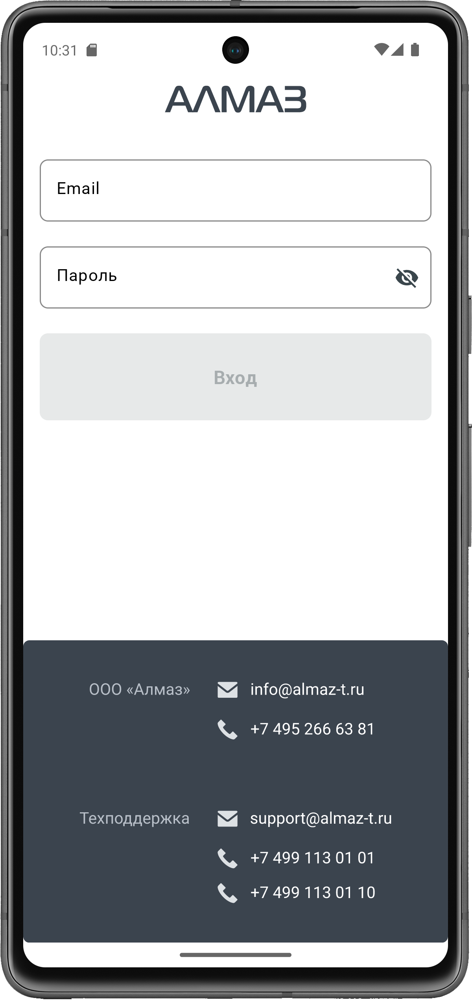
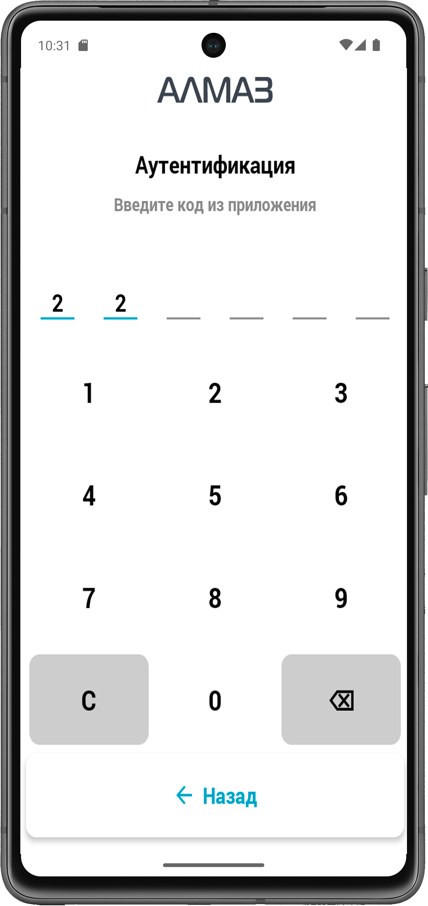
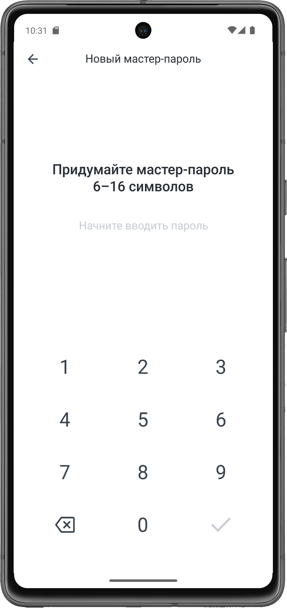
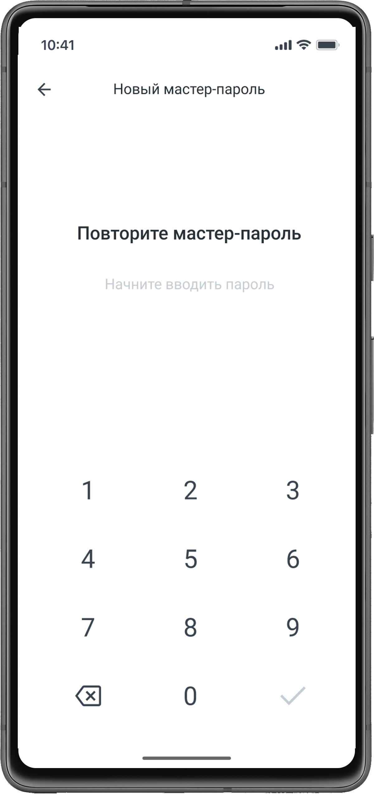

Для входа в приложение **«Алмаз-Онлайн»** на терминале **Centerm K9** необходимо ввести данные от личного кабинета **«Алмаз-Онлайн»**:

- email;
- пароль.

После ввода данных нажмите кнопку **«Войти»**.

| Терминал |
| --- |
| { width="260"} |

---

## Подтверждение входа

После ввода email и пароля необходимо пройти подтверждение входа.

Код подтверждения зависит от способа аутентификации, который настроен в личном кабинете **«Алмаз-Онлайн»**.

Возможные способы подтверждения:

| Способ аутентификации | Что нужно ввести |
|---|---|
| **СМС** | Код из SMS-сообщения |
| **OTP** | Одноразовый код из приложения-аутентификатора |

Введите полученный код подтверждения в соответствующее поле.

| Терминал |
| --- |
| { width="260"}|

---

## Создание пароля для быстрого входа

После успешного подтверждения входа необходимо придумать пароль для быстрого входа в приложение.

Пароль быстрого входа используется для повторного доступа к приложению в течение рабочего дня.

Для настройки пароля:

1. Придумайте пароль для быстрого входа.
2. Введите его в соответствующее поле.
3. Повторно введите пароль для подтверждения.
4. Завершите настройку.

!!! info "Примечание"
    Для каждой учётной записи используется отдельный пароль быстрого входа.

| Создание нового пин-кода | Подтверждение пин-кода |
|---|---|
| { height="240" } | { height="240" } |

---

!!! warning "Важно"
    Не передавайте пароль от личного кабинета, код подтверждения и пароль быстрого входа третьим лицам.