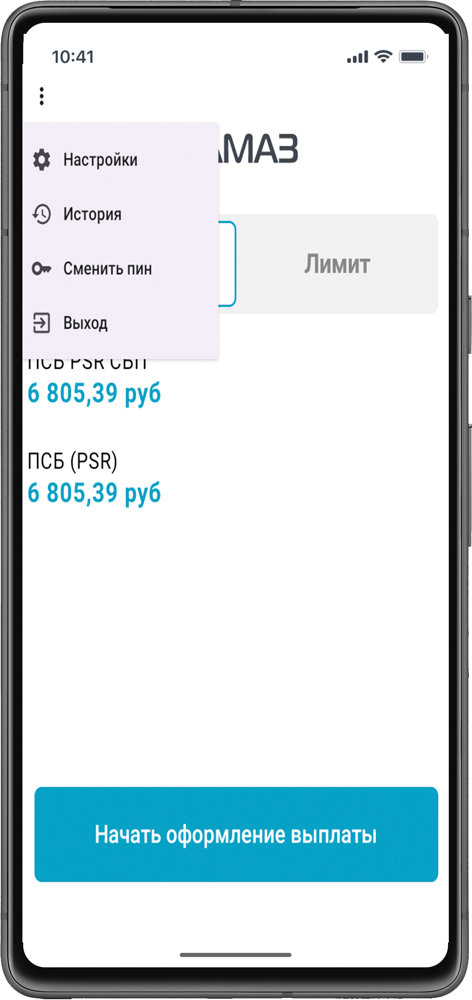
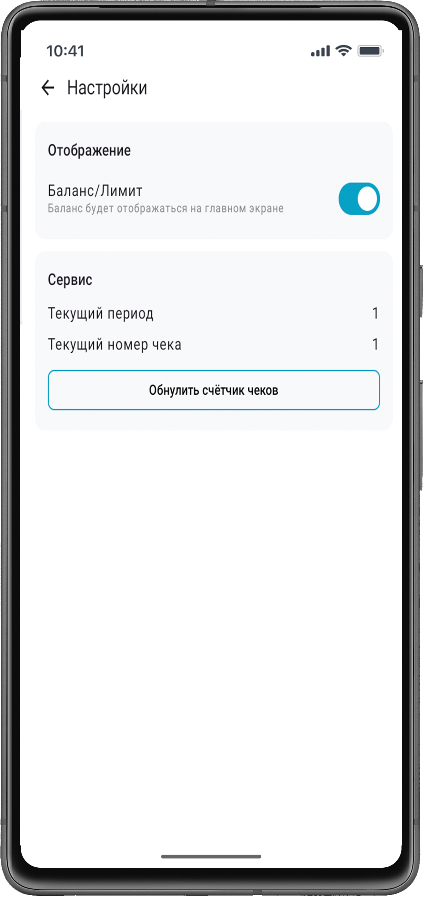
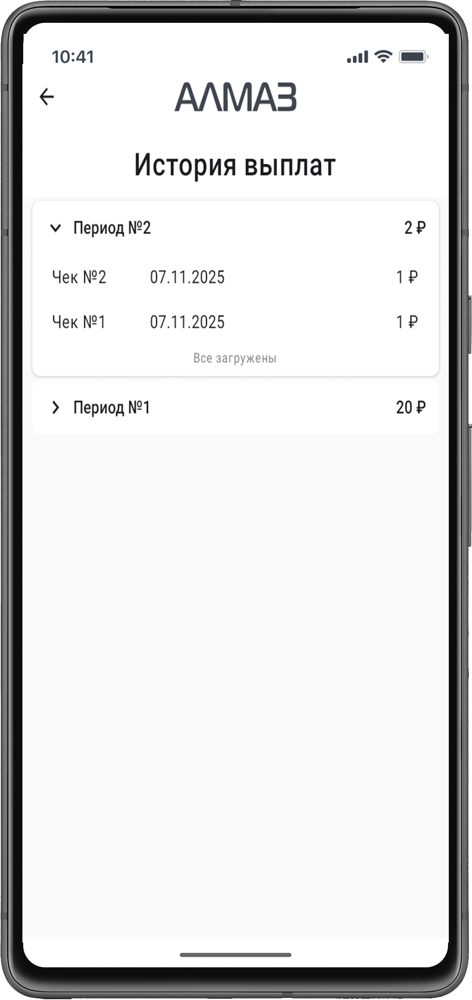
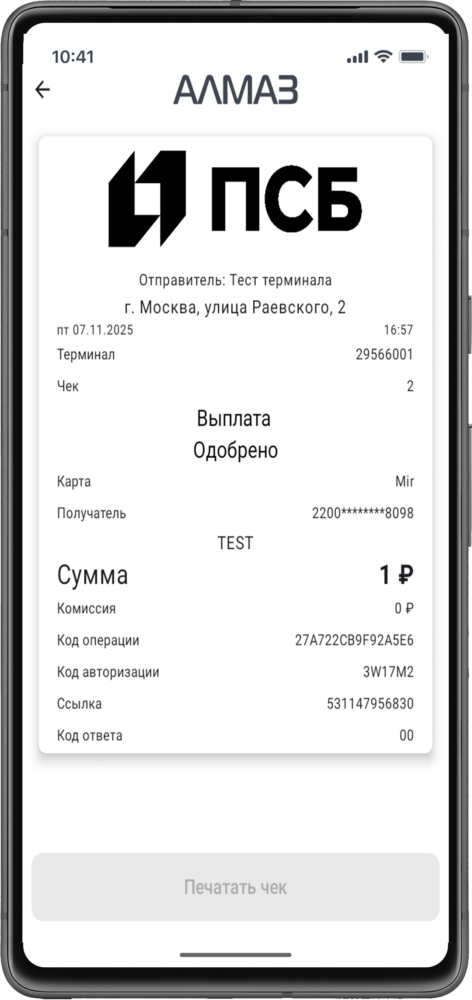

Главное меню приложения **«Алмаз-Онлайн»** на терминале **Centerm K9** используется для перехода к дополнительным функциям приложения.

В главном меню доступны следующие пункты:

- **Настройки**;
- **История**;
- **Смена пин-кода**.

| Терминал |
| --- |
| { width="260"} |

---

## Настройки

Пункт **«Настройки»** доступен только пользователю с правами администратора организации.

В окне **«Настройки»** можно управлять параметрами отображения и нумерации чеков.

В настройках доступны:

| Параметр | Описание |
|---|---|
| **Отображение баланса / лимита** | Настройка отображения баланса или лимита на главном экране |
| **Текущий период** | Отображение текущего периода нумерации чеков |
| **Номер чека** | Отображение текущего номера чека |
| **Сброс нумерации чека** | Кнопка для обнуления счётчика чеков |

!!! info "Примечание"
    При обнулении счётчика чеков текущий период увеличивается на **1**.

| Терминал |
| --- |
| { width="260"}|

---

## История

Окно **«История»** отображает периоды и чеки успешных платежей.

В этом разделе можно просмотреть ранее выполненные успешные операции.

При нажатии на чек открывается окно с возможностью повторной печати чека.

| Терминал |
| --- |
| { width="260"}|

---

## Повторная печать чека

Для повторной печати чека выполните следующие действия:

1. Откройте главное меню.
2. Перейдите в раздел **«История»**.
3. Выберите нужный период.
4. Нажмите на нужный чек.
5. В открывшемся окне выполните повторную печать.

| Терминал |
| --- |
| { width="260"} |

---

## Смена пин-кода

Кнопка **«Сменить пин»** позволяет установить новый пин-код для текущей учётной записи.

Пин-код используется для быстрого доступа в приложение в течение рабочего дня.

!!! warning "Важно"
    Новый пин-код устанавливается только для текущей учётной записи. Для другой учётной записи пин-код настраивается отдельно.
