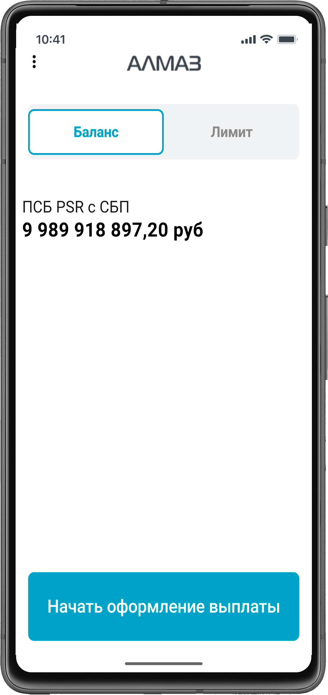

Главный экран приложения **«Алмаз-Онлайн»** на терминале **Centerm K9** используется для просмотра доступного баланса и начала оформления выплаты.

| Терминал |
| --- |
| { width="260"} |

---

## Что отображается на главном экране

На главном экране отображаются:

- баланс;
- кнопка начала оформления выплаты;
- меню дополнительных действий.

---

## Баланс

На главном экране отображается текущий баланс, доступный для проведения выплат.

Баланс может быть скрыт администратором организации.

Для скрытия баланса администратору необходимо открыть меню под кнопкой с тремя вертикальными точками и выбрать соответствующее действие.

!!! info "Примечание"
    Возможность скрытия баланса доступна администратору организации.

---

## Начало оформления выплаты

Для начала оформления выплаты нажмите кнопку начала выплаты на главном экране.

После нажатия откроется форма оформления выплаты.

---

!!! warning "Важно"
    Перед началом оформления выплаты убедитесь, что выбранная учётная запись имеет доступ к проведению операций.