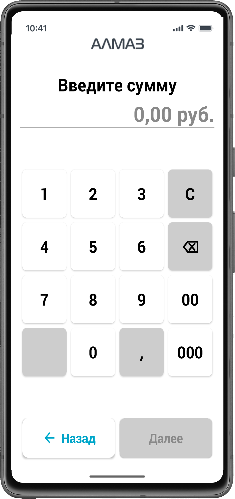
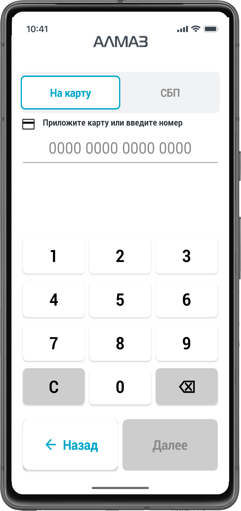
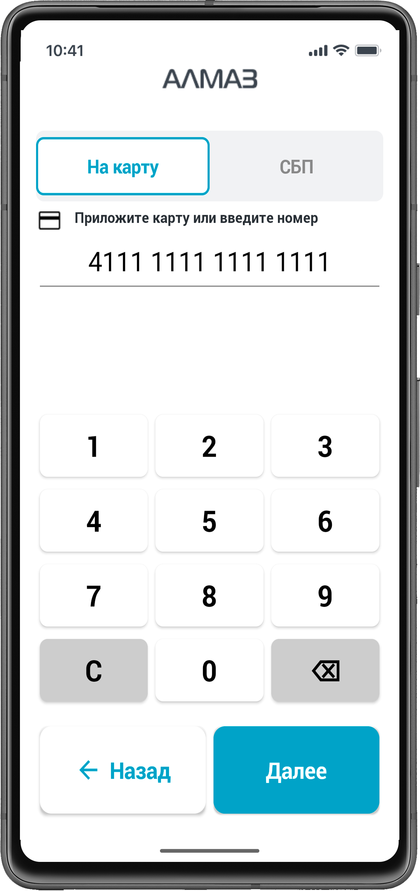
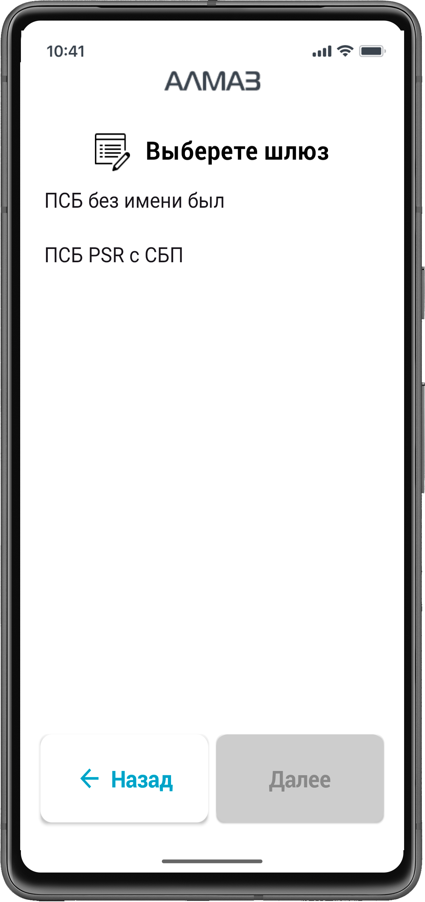
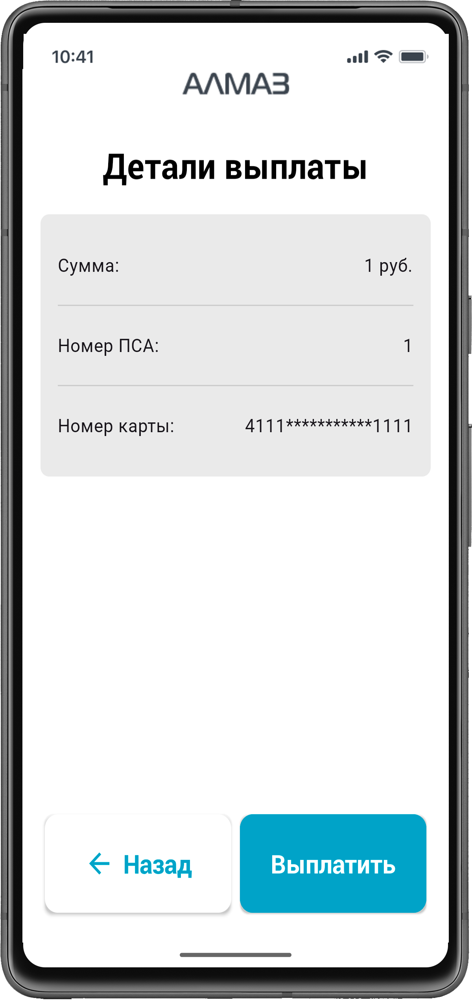
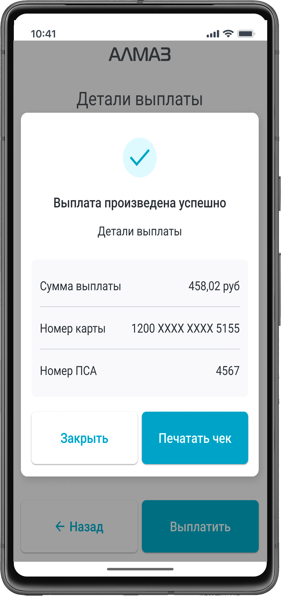
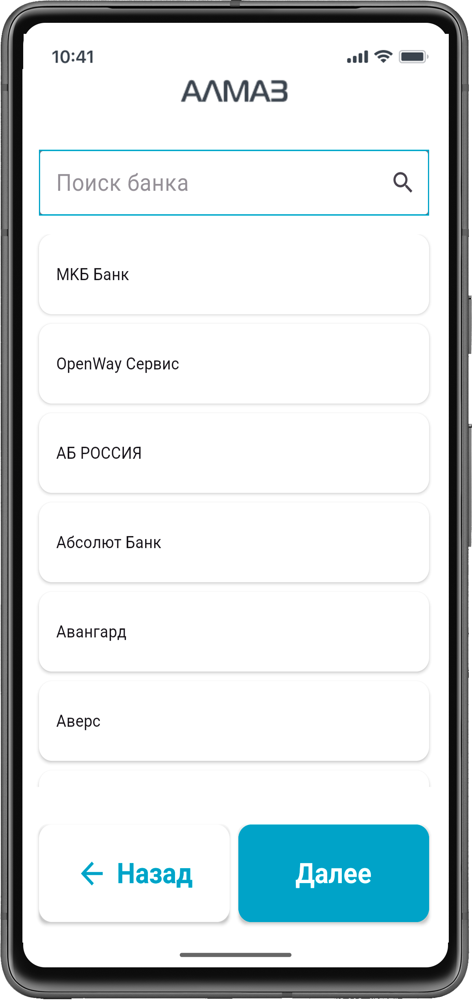
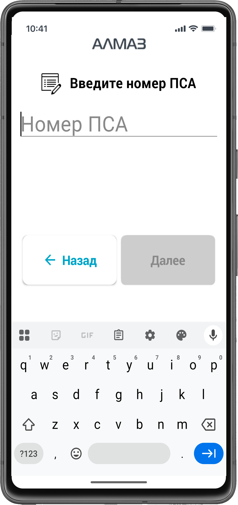
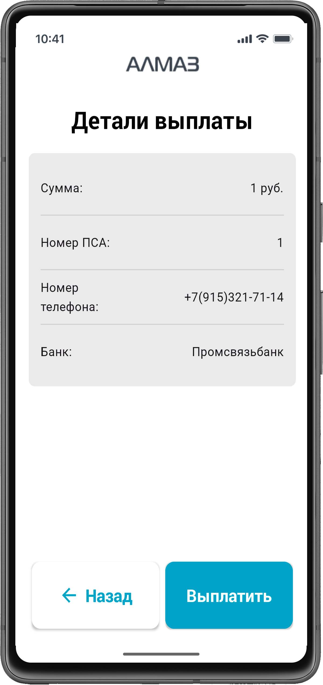

Раздел описывает порядок оформления выплаты в приложении **«Алмаз-Онлайн»** на терминале **Centerm K9**.

В приложении доступны два способа выплаты:

- перевод по номеру карты;
- перевод по номеру телефона через **СБП**.

---

## Ввод суммы

На первом шаге необходимо ввести сумму выплаты.

Ввод суммы осуществляется с экранной клавиатуры.

После ввода суммы нажмите кнопку **«Далее»**.

!!! warning "Важно"
    Перед переходом к следующему шагу проверьте корректность введённой суммы.

| Терминал |
| --- |
| { width="260"} |

---

## Выбор способа выплаты

Приложение предоставляет два способа выплаты:

| Способ выплаты | Описание |
|---|---|
| **Перевод по номеру карты** | Выплата выполняется на банковскую карту получателя |
| **Перевод по номеру телефона, СБП** | Выплата выполняется по номеру телефона через Систему быстрых платежей |

По умолчанию выбран способ **«Перевод по номеру карты»**.

Для выбора выплаты через **СБП** необходимо перейти на вкладку **«СБП»**.

| Терминал |
| --- |
| { width="260"} |

---

# Перевод по номеру карты

## Ввод номера карты

Для осуществления перевода по номеру карты необходимо выполнить одно из действий:

- ввести номер карты вручную;
- приложить карту к картридеру;
- вставить карту в картридер.

После ввода или считывания карты нажмите кнопку **«Далее»**.

| Терминал |
| --- |
| { width="260"} |

---

## Ввод номера ПСА

На следующем экране необходимо ввести номер **ПСА**.

После ввода номера ПСА нажмите кнопку **«Далее»**.

| Терминал |
| --- |
| { width="260"} |

---

## Выбор шлюза оплаты

После ввода номера ПСА необходимо выбрать платёжный шлюз для оплаты.

Выберите доступный шлюз из списка.

| Терминал |
| --- |
| { width="260"} |

---

## Выплата

После выбора шлюза нажмите кнопку **«Выплатить»**.

Приложение отправит заявку на проведение выплаты.

| Терминал |
| --- |
| { width="260"} |

---

## Завершение выплаты

После успешной выплаты можно:

- распечатать терминальный чек;
- вернуться на главный экран.

| Терминал |
| --- |
| { width="260"} |

---

# Перевод по СБП

## Выбор способа СБП

Для выплаты через СБП переключитесь на вкладку **«СБП»**.

---

## Ввод номера телефона

Введите номер телефона получателя перевода.

Номер телефона вводится **без `+7`**.

!!! info "Пример"
    Если номер телефона `+7 900 123-45-67`, введите `9001234567`.

| Терминал |
| --- |
| { width="260"} |

---

## Выбор банка получателя

После ввода номера телефона выберите банк получателя перевода.

Затем нажмите кнопку **«Далее»**.

| Терминал |
| --- |
| { width="260"} |

---

## Ввод номера ПСА

На следующем экране введите номер **ПСА**.

После ввода номера ПСА нажмите **«Далее»**.

| Терминал |
| --- |
| { width="260"} |

---

## Выбор шлюза оплаты

Выберите платёжный шлюз, через который будет выполнена оплата.

| Терминал |
| --- |
| { width="260"} |

---

## Выплата

Нажмите кнопку **«Выплатить»**.

| Терминал |
| --- |
| { width="260"} |

После этого выплату можно подтвердить или отменить.

| Терминал |
| --- |
| { width="260"} |

---

## Завершение выплаты

После выполнения операции можно:

- распечатать терминальный чек;
- вернуться на главный экран.

| Терминал |
| --- |
| { width="260"} |

---

## Возможные проблемы

| Проблема | Возможная причина | Что сделать |
|---|---|---|
| Не удаётся перейти дальше после ввода суммы | Сумма не введена или введена некорректно | Проверьте сумму и повторите ввод |
| Карта не считывается | Карта приложена неправильно или картридер не считал данные | Повторите считывание или введите номер карты вручную |
| Нет доступного шлюза оплаты | У пользователя нет доступа к шлюзу или шлюз не настроен | Обратитесь к администратору организации |
| Выплата не проходит | Ошибка банка, недостаточно средств или неверные данные | Проверьте данные выплаты и статус операции |

!!! warning "Важно"
    Перед нажатием кнопки **«Выплатить»** проверьте сумму, номер карты или телефона, номер ПСА и выбранный платёжный шлюз.