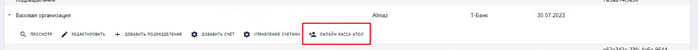
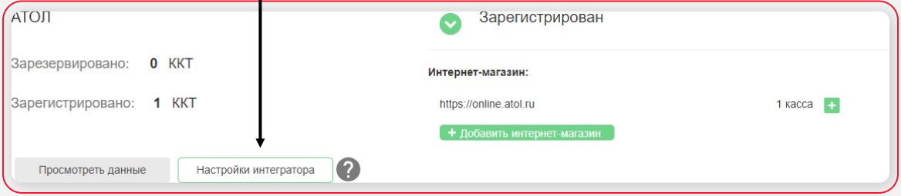
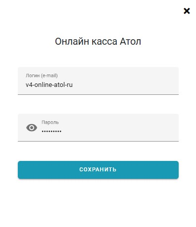
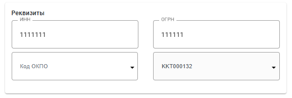
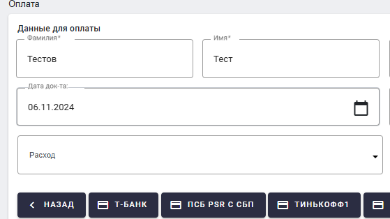

В системе **«Алмаз-Онлайн»** предусмотрено подключение онлайн-кассы **Атол**.

Онлайн-касса используется для формирования и отправки чеков по операциям.

---

## Подключение онлайн-кассы Атол

Для подключения онлайн-кассы **Атол** необходимо авторизоваться в системе **«Алмаз-Онлайн»** под пользователем с ролью **Администратор** базовой организации.

---

## Переход к настройке

Для перехода к настройке выполните следующие действия:

1. Авторизуйтесь в системе **«Алмаз-Онлайн»** под ролью **Администратор** базовой организации.

2. Перейдите в раздел меню:

    **Администрирование → Реестр организаций**

3. Выделите в реестре **Базовую организацию**.

4. В раскрытом списке действий выберите кнопку **«Онлайн касса Атол»**.

---

## Получение логина и пароля Атол

Для получения логина и пароля системы **Атол** выполните следующие действия:

1. Перейдите в личный кабинет **«Онлайн-кассы Атол»**.

2. Откройте раздел **«Мои компании»**.

3. Нажмите кнопку **«Настройки интегратора»**.

4. Получите данные, необходимые для интеграции.

!!! info "Примечание"
    Логин и пароль используются для авторизации в системе Атол при подключении онлайн-кассы к **«Алмаз-Онлайн»**.

---

## Авторизация в системе Атол

В появившемся окне авторизуйтесь с учётными данными системы **Атол**.

После успешной авторизации можно продолжить настройку кассы в системе **«Алмаз-Онлайн»**.

---

## Настройка ККТ для подразделения

После успешной авторизации в системе Атол необходимо настроить ККТ для подразделений.

Для этого:

1. Перейдите в раздел:

    **Администрирование → Реестр организаций**

2. Выберите необходимое подразделение.

3. Нажмите кнопку **«Редактировать»**.

4. Откройте вкладку **«Данные организации»**.

5. В блоке **«Реквизиты»** выберите нужную **ККТ**.

!!! info "Примечание"
    В каждом подразделении необходимо выбрать ККТ. При необходимости можно использовать одну и ту же ККТ в нескольких подразделениях.

---

## Использование онлайн-кассы при оплате

При оплате на странице выбора платёжного шлюза по умолчанию установлен тип операции:

**«Расход»**

Чек применяется, если в документе есть номенклатура.

!!! warning "Важно"
    Если в документе отсутствует номенклатура, чек не применяется.

---

## Отправка чека

После успешной оплаты чек отправляется на email-адрес организации.

!!! tip "Рекомендация"
    Перед проведением оплаты проверьте, что в карточке организации указан корректный email-адрес.

---

## Возможные проблемы

| Проблема | Возможная причина | Что сделать |
|---|---|---|
| Нет кнопки **«Онлайн касса Атол»** | Недостаточно прав или выбрана не базовая организация | Проверить роль пользователя и выбранную организацию |
| Не получается авторизоваться в Атол | Неверные учётные данные | Проверить логин и пароль в личном кабинете Атол |
| ККТ не отображается в подразделении | Интеграция не настроена или авторизация в Атол не выполнена | Повторить настройку подключения |
| Чек не формируется | В документе отсутствует номенклатура | Проверить наличие номенклатуры в документе |
| Чек не пришёл на email | Неверно указан email организации или произошла ошибка отправки | Проверить email в карточке организации и обратиться в техническую поддержку |

!!! warning "Важно"
    Настройку онлайн-кассы Атол рекомендуется выполнять совместно с ответственным сотрудником организации или специалистом технической поддержки.