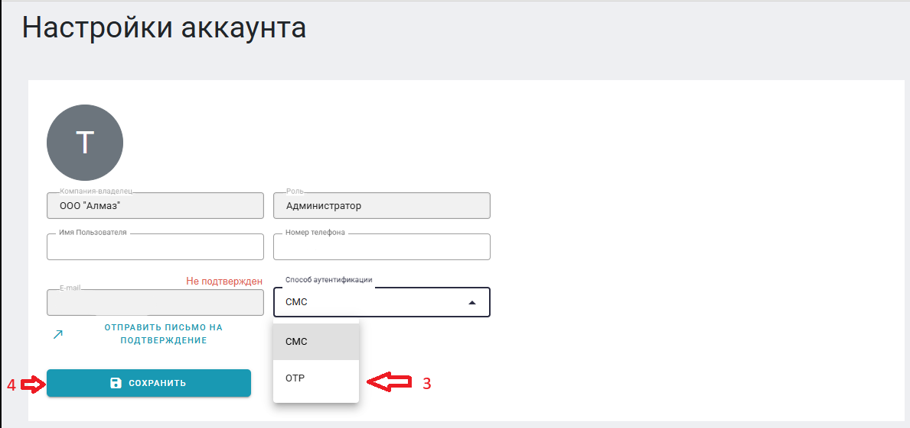
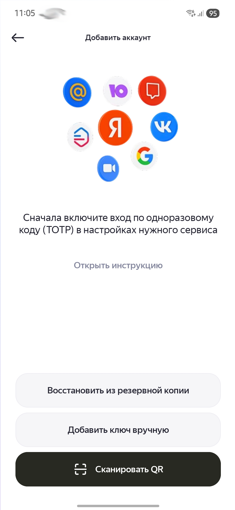
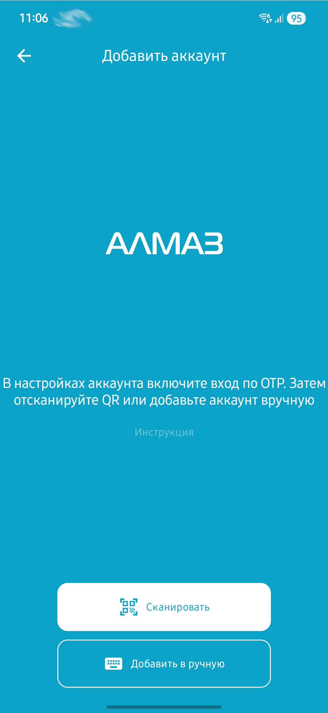
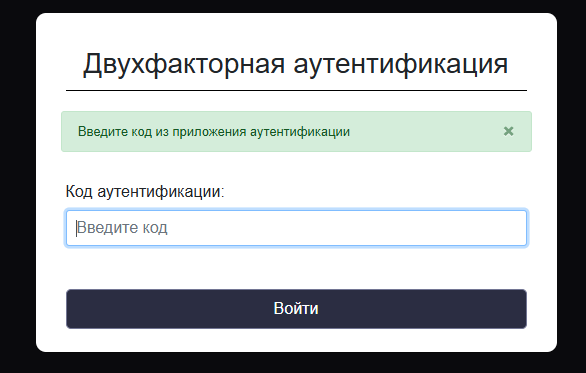
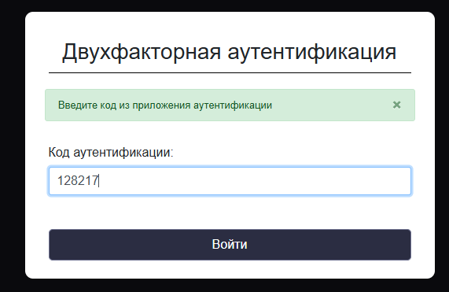

В системе **«Алмаз-Онлайн»** пользователь может использовать вход с подтверждением по одноразовому 6-значному коду из приложения-аутентификатора.

Для этого используется способ аутентификации **OTP**.

!!! info "Рекомендуемое приложение"
    Для получения одноразовых кодов рекомендуется использовать приложение **Яндекс.Ключ** или наше приложение **AlmazOTP**.

Ссылка для скачивания:

[https://yandex.ru/id/key/main](https://yandex.ru/id/key/main)

---
<video controls width="100%">
  <source src="../../../assets/web/video/otp.mp4" type="video/mp4">
  Ваш браузер не поддерживает воспроизведение видео.
</video>
## Включение получения 6-значного кода аутентификации

Для включения возможности получения 6-значного кода в приложении-аутентификаторе необходимо выполнить следующие действия:

1. Нажмите на иконку профиля.

2. Нажмите **«Настройки аккаунта»**.
{ width="800" align=center }

3. В выпадающем меню **«Способ аутентификации»** замените значение:

    **«СМС» → «OTP»**

4. Нажмите кнопку **«Сохранить»**.
{ width="800" align=center }
5. После сохранения отобразится блок с:

    - секретным ключом;
    - QR-кодом.
{ width="800" align=center }
!!! note "Примечание"
    Секретный ключ используется для ручного добавления аккаунта в приложение-аутентификатор. QR-код используется для быстрого добавления аккаунта через сканирование.

---

## Запрет на смену способа аутентификации с OTP на СМС

По умолчанию пользователь может изменить способ аутентификации.

Чтобы запретить пользователю смену способа аутентификации с **OTP** на **СМС**, необходимо выключить переключатель:

**«Разрешить смену способа аутентификации»**

После этого в настройках аккаунта пользователь не сможет самостоятельно сменить способ аутентификации с **OTP** на **СМС**.
{ width="800" align=center }
!!! warning "Важно"
    Переключение с **СМС** на **OTP** остаётся доступным. После выбора способа **OTP** поле с разрешением смены способа аутентификации пропадёт, и пользователю необходимо нажать кнопку **«Сохранить»** для подтверждения изменений.

---

## Использование приложения-аутентификатора

Для настройки приложения-аутентификатора выполните следующие действия:

1. Запустите приложение-аутентификатор.

2. Нажмите кнопку добавления аккаунта.

| Яндекс.Ключ | AlmazOTP |
|---|---|
| { height="240" } | { height="240" } |

3. Выберите удобный способ добавления аккаунта:

    - сканирование QR-кода;
    - добавление данных вручную.

| Яндекс.Ключ | AlmazOTP |
|---|---|
| { height="240" } | { height="240" } |

---

## Добавление аккаунта через QR-код

Если выбран способ **«Сканировать QR-код»**, необходимо навести рамку сканера на QR-код, отображаемый в личном кабинете **«Алмаз-Онлайн»**.

После успешного сканирования аккаунт будет добавлен в приложение-аутентификатор.

---

## Добавление аккаунта вручную

Если выбран способ **«Добавить вручную»**, необходимо заполнить следующие поля:

| Поле | Значение |
|---|---|
| Название сервиса | `Almaz-Online` |
| Логин на сервисе | Email от личного кабинета Almaz-Online |
| Секретный ключ | Секретный ключ, указанный в личном кабинете над QR-кодом |

| Яндекс.Ключ | AlmazOTP |
|---|---|
| { height="240" } | { height="240" } |

!!! tip "Совет"
    Если QR-код не сканируется, используйте ручное добавление по секретному ключу.

---

## Авторизация с использованием одноразового пароля из приложения

Для авторизации в личном кабинете **Almaz-Online** с использованием одноразового кода выполните следующие действия:

1. Перейдите по адресу:

    [https://almaz-online.ru](https://almaz-online.ru)

2. Нажмите кнопку **«Авторизоваться»**.
{ height="240" }

3. Введите email и пароль от учётной записи.
{ height="240" }

4. Откроется окно для ввода кода подтверждения.
{ height="240" }

5. Откройте приложение-аутентификатор.

6. Найдите в списке аккаунт **Almaz-Online**.

7. Нажмите на аккаунт, чтобы получить текущий 6-значный код.

8. Введите сгенерированный код в окне подтверждения.

9. Нажмите кнопку **«Войти»**.
{ height="240" }

После успешной проверки кода система откроет личный кабинет пользователя.

---