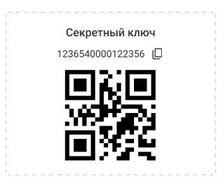

В системе **«Алмаз-Онлайн»** можно включить дополнительное подтверждение платежа для пользователя.

Если у пользователя включено **«Подтверждение платежа»**, при оплате ПСА потребуется ввести 6-значный код из приложения-аутентификатора.

---

## Включение подтверждения платежа

Для включения подтверждения платежа администратору организации необходимо выполнить следующие действия:

1. Перейти в раздел **«Администрирование»**.

2. Открыть подраздел **«Учётные записи»**.

3. Выбрать нужного пользователя.

4. Открыть окно редактирования учётной записи.

5. Включить переключатель **«Подтверждение платежа»**.

6. Сохранить изменения.

!!! info "Примечание"
    Включение подтверждения платежа выполняется администратором организации для конкретного пользователя.

---

## Настройка приложения-аутентификатора

Пользователю, у которого включено **«Подтверждение платежа»**, необходимо установить на мобильное устройство приложение-аутентификатор.

Рекомендуется использовать приложение **Яндекс.Ключ**.

После установки приложения необходимо:

1. Перейти в профиль пользователя в системе **«Алмаз-Онлайн»**.

2. Отсканировать QR-код через приложение **Яндекс.Ключ**.

3. Если сканирование QR-кода недоступно, ввести секретный ключ вручную.

!!! tip "Рекомендация"
    Если QR-код не сканируется, используйте ручное добавление аккаунта по секретному ключу.

---

## Использование кода подтверждения

В приложении **Яндекс.Ключ** будут генерироваться 6-значные коды для подтверждения платежа.

Этот код необходимо вводить в окно подтверждения платежа при оплате ПСА.

---

## Подтверждение платежа при оплате ПСА

При оплате ПСА пользователь выполняет стандартные действия по оплате документа.

Если для пользователя включено **«Подтверждение платежа»**, система дополнительно откроет окно подтверждения.

В этом окне необходимо:

1. Открыть приложение **Яндекс.Ключ**.

2. Найти нужный аккаунт.

3. Получить текущий 6-значный код.

4. Ввести код в окно подтверждения платежа.

5. Подтвердить операцию.

После успешного ввода кода система продолжит выполнение оплаты.

---

## Возможные проблемы

| Проблема | Возможная причина | Что сделать |
|---|---|---|
| При оплате требуется код | У пользователя включено **«Подтверждение платежа»** | Ввести 6-значный код из приложения-аутентификатора |
| Код не подходит | Неверное время на телефоне или код устарел | Проверить время на телефоне и дождаться нового кода |

!!! warning "Важно"
    Не передавайте секретный ключ и одноразовые коды третьим лицам. Эти данные используются для подтверждения платежей.