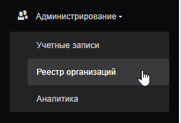

## Назначение

Раздел **«Реестр организаций»** используется для настройки структуры предприятия, структурных подразделений и точек оплаты ПЗУ.

Платёжные точки позволяют организовать работу приёмо-заготовительных участков и связать их с нужной организационной структурой.
<video controls width="100%">
  <source src="../../assets/web/video/payment-point.mp4" type="video/mp4">
  Ваш браузер не поддерживает воспроизведение видео.
</video>
---

## Переход в реестр организаций

Для настройки платёжных точек выполните следующие действия:
{align=center}

1. Откройте раздел меню **«Администрирование»**.

2. Выберите подраздел **«Реестр организаций»**.

3. В открывшемся реестре выберите организацию, для которой необходимо настроить структуру предприятия.

---

## Добавление подразделения

Чтобы спроектировать структуру предприятия:

1. Выделите нужную **организацию** в реестре.

2. Нажмите кнопку **«Добавить подразделение»**.
{ height="240" align=center }

3. Откроется карточка добавления подразделения.
{ height="240" align=center }

4. В открывшейся карточке выберите раздел **«Данные организации»**.

!!! info "Примечание"
    Подразделение добавляется внутри выбранной организации. Перед нажатием кнопки **«Добавить подразделение»** убедитесь, что выбрана нужная организация.

---

## Выбор типа подразделения

В поле **«Тип подразделения»** выберите одно из значений:

| Тип подразделения | Описание |
|---|---|
| **Организация** | Юридическое лицо или основная организация |
| **Структурное подразделение** | Внутреннее подразделение организации |
| **ПЗУ** | Приёмо-заготовительный участок или точка оплаты |

---

## Заполнение данных подразделения

После выбора типа подразделения заполните данные по подразделению.

Указываются:

- наименование подразделения;
- тип подразделения;
- реквизиты;
- адрес;
- контактные данные;
- и другие данные.

---

## Сохранение подразделения

После ввода всех данных нажмите кнопку **«Сохранить»**.

Если данные заполнены корректно, подразделение будет добавлено в структуру предприятия.

---

!!! tip "Рекомендация"
    Перед настройкой платёжных точек заранее определите структуру предприятия.