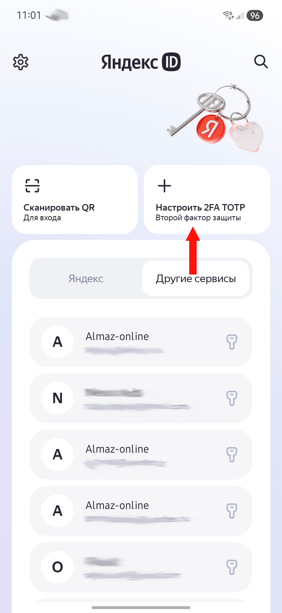
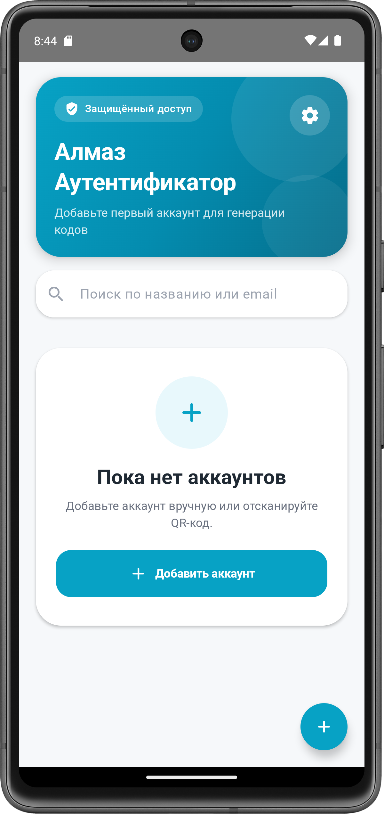
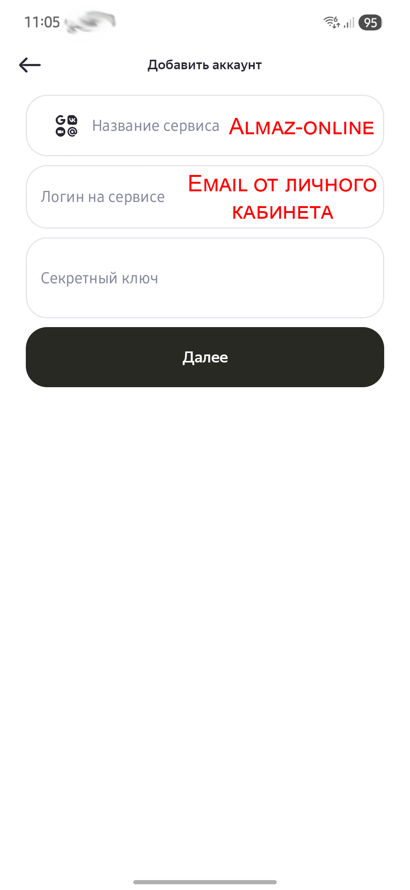

Двухфакторная аутентификация используется для дополнительной защиты учётной записи пользователя в системе **«Алмаз-Онлайн»**.

При включённой аутентификации по **OTP** для входа в систему требуется одноразовый 6-значный код из приложения-аутентификатора.

Для получения кодов можно использовать:

- **Яндекс.Ключ**;
- **Google Authenticator**;
- **Алмаз Аутентификатор**.

---

## Яндекс.Ключ

### Установка приложения

Установите приложение **Яндекс.Ключ** на смартфон или планшет.

Приложение можно установить из доступного магазина приложений:

- App Store;
- Google Play;
- RuStore;
- другой доступный магазин приложений.

После установки запустите приложение из списка приложений и выполните настройку по инструкции внутри приложения.

---

### Добавление аккаунта

Для добавления аккаунта выполните следующие действия:

1. Откройте приложение **Яндекс.Ключ**.
2. Нажмите кнопку добавления аккаунта.
3. Выберите удобный способ добавления:
    - сканирование QR-кода;
    - ручной ввод данных.

---

### Добавление через QR-код

Если выбран пункт **«Сканировать QR»**, наведите рамку сканера на QR-код, который отображается в личном кабинете **«Алмаз-Онлайн»**.

После сканирования аккаунт будет добавлен в приложение.

---

### Добавление вручную

Если выбран пункт **«Добавить вручную»**, заполните поля:

| Поле | Значение |
|---|---|
| **Название сервиса** | `Almaz-Online` |
| **Логин на сервисе** | Email от личного кабинета Almaz-Online |
| **Секретный ключ** | Секретный ключ, указанный рядом с QR-кодом |

!!! tip "Совет"
    Если QR-код не сканируется, используйте ручной ввод секретного ключа.

---

## Google Authenticator

### Установка приложения

Установите приложение **Google Authenticator** на смартфон или планшет.

Приложение можно установить из доступного магазина приложений:

- App Store;
- Google Play;
- RuStore;
- другой доступный магазин приложений.

---

### Добавление аккаунта

После установки выполните следующие действия:

1. Запустите приложение **Google Authenticator**.
2. Начните процесс добавления аккаунта.
3. Выберите способ настройки:
    - сканирование QR-кода;
    - ручной ввод ключа.

---

### Настройка через QR-код или вручную

Отсканируйте QR-код из личного кабинета **«Алмаз-Онлайн»** или введите данные вручную.

Для ручного ввода укажите:

| Поле | Значение |
|---|---|
| **Название** | `Almaz-Online` |
| **Ключ** | Секретный ключ, указанный рядом с QR-кодом |

---

## Алмаз Аутентификатор

**Алмаз Аутентификатор** — это приложение для Android, которое создаёт одноразовые пароли для дополнительной защиты аккаунтов.

Чтобы использовать **Алмаз Аутентификатор**, необходимо в личном кабинете **«Алмаз-Онлайн»** включить двухфакторную аутентификацию через **OTP**.

### Добавление аккаунта

После установки выполните следующие действия:

1. Запустите приложение **Алмаз Аутентификатор**.
2. Начните процесс добавления аккаунта.
3. Выберите способ настройки:
    - сканирование QR-кода;
    - ручной ввод ключа.

---

| Яндекс.Ключ | AlmazOTP | Google Authenticator |
|---|---|---|
| { width="220" } | { width="220" } | { width="220" } |

| Яндекс.Ключ | AlmazOTP | Google Authenticator|
|---|---| --- |
| { width="220" } | { width="220" } | { width="220" } |

## Зачем нужна аутентификация через приложение

Постоянный пароль от аккаунта должен быть сложным, его необходимо помнить и хранить в секрете.

Даже если пользователь соблюдает правила безопасности, пароль может оставаться уязвимым, например при наличии вредоносного программного обеспечения на устройстве.

Одноразовый код из приложения повышает безопасность входа, так как для авторизации требуется не только пароль, но и временный код, который генерируется на устройстве пользователя.

!!! warning "Важно"
    Не передавайте секретный ключ и одноразовые коды третьим лицам. Эти данные используются для доступа к вашей учётной записи.

!!! tip "Рекомендация"
    После подключения OTP рекомендуется проверить вход в систему и убедиться, что код из приложения принимается корректно.